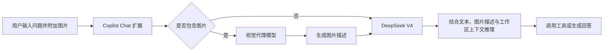

# 为 DeepSeek V4 补上视觉能力：Copilot Chat 视觉代理实践

这次实践只想解决一个具体问题：**DeepSeek V4 擅长推理、编码和工具调用，却不能直接看懂图片。**

在实际开发中，很多关键信息偏偏存在于图片里，例如 UI 错位截图、终端报错、架构图、监控图表和设计稿。如果主模型无法读取这些信息，Agent 就只能依赖用户手工描述，定位效率和准确度都会下降。

解决办法不是替换 DeepSeek，而是为它增加一个**视觉前置处理环节**：先让具备视觉能力的模型把图片转换成结构化描述，再把描述连同用户问题交给 DeepSeek V4 推理。DeepSeek 仍然是负责分析、编码和执行任务的主模型，视觉模型只负责弥补它“看不见”的缺点。

本文以 [DeepSeek V4 for Copilot Chat](https://marketplace.visualstudio.com/items?itemName=Vizards.deepseek-v4-for-copilot) 扩展为例，说明这条链路如何工作、怎样配置，以及使用时需要注意什么。

> 这里补上的视觉能力来自模型协作，不代表 DeepSeek V4 获得了原生视觉能力。

## 为什么需要补上视觉能力

只使用纯文本 DeepSeek 时，常见工作流会多出一道人工转换：用户先观察图片，再用文字复述问题。这个过程容易遗漏细节，也会让 Agent 失去第一手证据。

接入视觉代理后，目标是让 DeepSeek 能继续处理这些原本无法进入上下文的信息：

- 从 UI 截图中获取遮挡、溢出、错位等可见现象
- 从终端截图中提取报错、命令和堆栈
- 从架构图中识别组件、依赖和数据流
- 从设计稿中理解页面层级与布局关系
- 从监控图表中读取趋势、峰值和异常区间

因此，这套方案的重点不是追求“模型越多越好”，而是在不更换 DeepSeek 主模型的前提下，补齐视觉输入通道。

## 核心思路：让不同模型各自负责擅长的部分

视觉代理的职责不是替 DeepSeek 回答问题，而是把图片转译成 DeepSeek 可以处理的文本上下文。



这条链路可以拆成四步：

1. 扩展检测聊天请求中是否包含图片。
2. 图片交给已安装且支持视觉输入的 Copilot 模型。
3. 视觉模型返回图片描述，而不是最终答案。
4. DeepSeek V4 根据用户问题、图片描述和当前会话上下文继续推理。

对用户而言，操作仍然是在 Copilot Chat 中拖入图片；模型分工由扩展在后台完成。

## 使用前提

按照扩展当前说明，使用前需要准备：

- VS Code `1.116` 或更高版本
- GitHub Copilot Free、Pro 或 Enterprise 账号
- DeepSeek API Key，或兼容服务商提供的 Token
- 在 VS Code 中正常登录 GitHub Copilot

需要特别区分两类调用：

| 调用环节 | 使用的凭据或额度 | 作用 |
| --- | --- | --- |
| DeepSeek V4 推理 | DeepSeek API Key（BYOK） | 负责推理、生成代码和工具调用 |
| 图片描述 | Copilot 登录后提供的套餐内额度 | 扩展自动调用账号中可用的视觉能力，无需额外配置 |

### 视觉环节为什么可以视为免费

登录 GitHub Copilot 后，Copilot Free 也会提供有限的 Chat/Agent 使用额度。根据实际测试，扩展会自动使用当前 Copilot 账号中可用的视觉能力，不需要手动选择视觉模型，不需要填写视觉模型 ID，也不需要额外配置 Claude、GPT 等视觉模型的 API Key。

因此，在 Copilot 套餐内免费额度没有耗尽的情况下，**图片识别这一环节可以视为免费**。需要付费或自行承担的主要是 DeepSeek V4 的 BYOK 推理调用。

这里的“免费”指不产生额外的视觉 API 费用，并不代表无限使用：免费额度、可选模型和不同模型的消耗规则可能调整，应以 Copilot 当前套餐页面显示为准。

## 安装与配置

### 1. 安装扩展

在 VS Code 扩展市场搜索：

```text
DeepSeek V4 for Copilot Chat
```

确认发布者和扩展标识为：

```text
Vizards.deepseek-v4-for-copilot
```

### 2. 配置 DeepSeek API Key

打开命令面板：

```text
macOS: Cmd + Shift + P
Windows / Linux: Ctrl + Shift + P
```

执行：

```text
DeepSeek: Set API Key
```

扩展会把密钥写入 VS Code SecretStorage，由操作系统密钥链管理，不需要把 API Key 明文放进 `settings.json`。

### 3. 选择 DeepSeek 模型

打开 Copilot Chat，在模型选择器中选择：

- `DeepSeek V4 Flash`：适合快速问答、日常修改和低成本迭代
- `DeepSeek V4 Pro`：适合复杂重构、长链路 Agent 任务和深度推理

如果模型提供推理强度选项，还可以按任务选择 `None`、`High` 或 `Max`。

### 4. 直接上传图片

完成 GitHub Copilot 登录、DeepSeek API Key 配置和模型选择后，就可以直接把截图拖入 Copilot Chat。

实际使用中不需要额外执行视觉代理配置命令，也不需要在 `settings.json` 中指定 `deepseek-copilot.visionModel`。扩展负责完成图片检测、视觉模型调用和描述转发，用户只会看到最终由 DeepSeek 生成的回答。

## 适合解决哪些问题

### UI 异常定位

把异常页面截图和相关组件文件一起交给 Agent，可以让视觉模型描述错位、溢出和遮挡现象，再由 DeepSeek 检查 DOM 与 CSS。

一个更有效的提示方式是：

```text
请先描述截图中的可见异常，再结合当前组件和样式文件定位原因。
不要只根据截图猜测；修改后请验证桌面端和移动端布局。
```

### 终端错误排查

终端截图中通常同时包含命令、堆栈和环境信息。视觉代理先提取文字，DeepSeek 再结合项目代码分析原因。

如果错误日志可以复制，优先直接粘贴文本。截图更适合作为无法复制内容的补充，而不是唯一证据。

### 架构图与流程图理解

可以让 Agent 从图中提取：

- 组件和服务名称
- 调用方向
- 数据流与依赖关系
- 可能缺失的异常分支

随后再生成 Mermaid、接口骨架或测试点。

### 设计稿辅助实现

截图可以帮助 Agent理解布局层级、颜色和间距，但它不能替代设计源文件。复杂页面最好同时提供：

- 目标截图
- 页面宽高或断点
- 字体和颜色规范
- 可复用组件范围
- 交互状态说明

## 使用中的边界

### 图片描述会损失信息

视觉模型输出的是文本摘要。细小文字、精确坐标、颜色差异和复杂空间关系可能在转译过程中丢失。

如果任务依赖像素级精度，应要求视觉代理明确列出不确定项，并使用浏览器或截图对比工具完成验证。

### 图片会经过另一个模型

图片不是直接发送给 DeepSeek，而是先交给视觉代理模型。因此，上传截图前要检查其中是否包含：

- API Key、Cookie 或访问令牌
- 用户隐私和业务数据
- 未公开代码或内部系统地址
- 客户信息和生产环境日志

敏感内容应先打码，企业环境还需要遵循组织的 Copilot 与模型使用策略。

### 依赖 VS Code 与 Copilot 接口

该扩展依赖 VS Code/Copilot Chat 的接口能力。扩展说明特别提示，部分接口并非稳定的公开接口，VS Code 更新后可能出现兼容性变化。

遇到模型消失、图片不生效或工具调用异常时，优先检查：

1. VS Code 与扩展版本是否匹配
2. Copilot Chat 是否正常登录
3. DeepSeek API Key 是否有效且有可用余额
4. Copilot 当前是否有可用额度，图片请求是否能正常完成
5. VS Code 输出面板中的扩展日志

## 一套可复用的验证清单

完成配置后，可以用下面几组任务验证链路，而不是只确认模型出现在选择器中。

| 验证项 | 操作 | 预期结果 |
| --- | --- | --- |
| 纯文本请求 | 不附加图片，询问一个代码问题 | DeepSeek 正常回答 |
| 图片识别 | 上传包含明显文字的截图 | 回答能准确引用图片内容 |
| 图片与代码联合分析 | 上传 UI 截图并附加相关组件 | 回答同时引用视觉现象和代码证据 |
| Agent 工具调用 | 要求检查文件并执行测试 | 能完成多轮工具调用 |
| 敏感信息保护 | 上传前检查并打码 | 请求中不包含密钥和隐私数据 |
| 额度观察 | 分别执行文本和图片请求 | 能区分 DeepSeek API 消耗与 Copilot 免费额度消耗 |

## 总结

这次实践的最终目的，是保留 DeepSeek V4 的推理、编码和 Agent 能力，同时弥补它无法直接读取图片的缺点。

视觉代理并不是把文本模型“伪装”成原生多模态模型，而是建立一条明确的视觉补偿管线：

- 视觉模型负责感知
- DeepSeek V4 负责推理
- Copilot Chat 负责上下文、工具和交互

这种方式不需要更换主模型，视觉端也可以按需要替换，适合把图片理解接入已有 DeepSeek Agent 工作流。但它同时引入了描述损失、多供应商数据流、额度消耗和版本兼容性问题。

真正可靠的使用方式，是把图片描述当作一条新的输入证据，并继续通过代码、日志、测试和浏览器结果验证结论。

## 参考资料

- [Visual Studio Marketplace：DeepSeek V4 for Copilot Chat](https://marketplace.visualstudio.com/items?itemName=Vizards.deepseek-v4-for-copilot)
- [GitHub：Vizards/deepseek-v4-for-copilot](https://github.com/Vizards/deepseek-v4-for-copilot)
- [DeepSeek Agent 集成参考：GitHub Copilot](https://github.com/deepseek-ai/awesome-deepseek-agent/blob/main/docs/github_copilot.md)
- [GitHub Copilot 套餐与免费额度](https://docs.github.com/en/copilot/get-started/plans)
