# AI使用分享

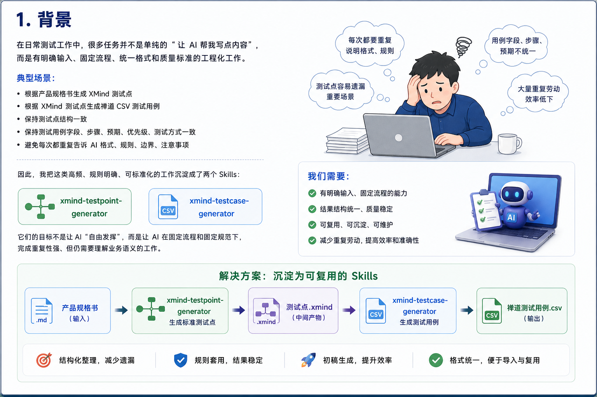


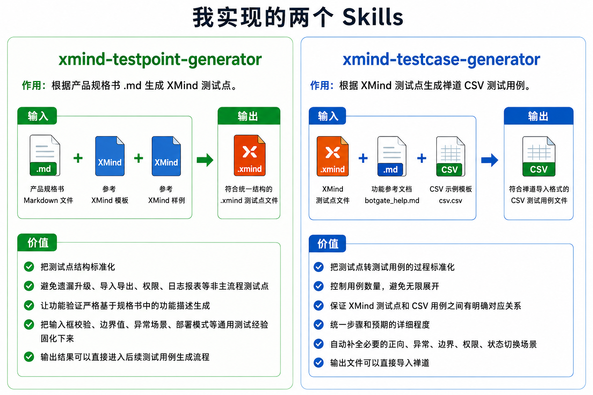

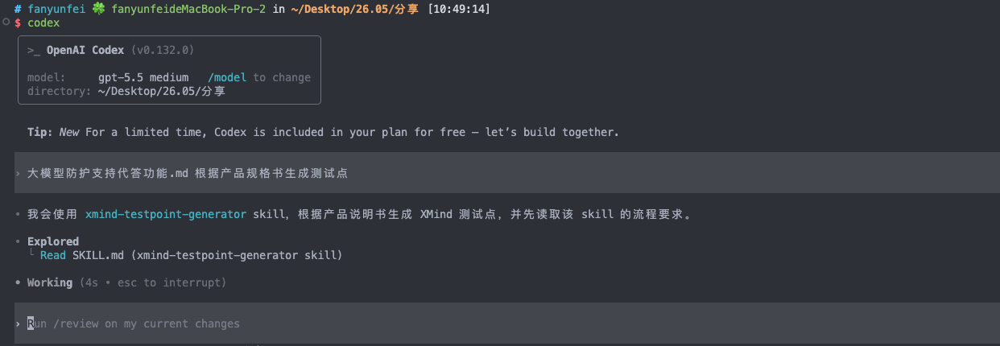 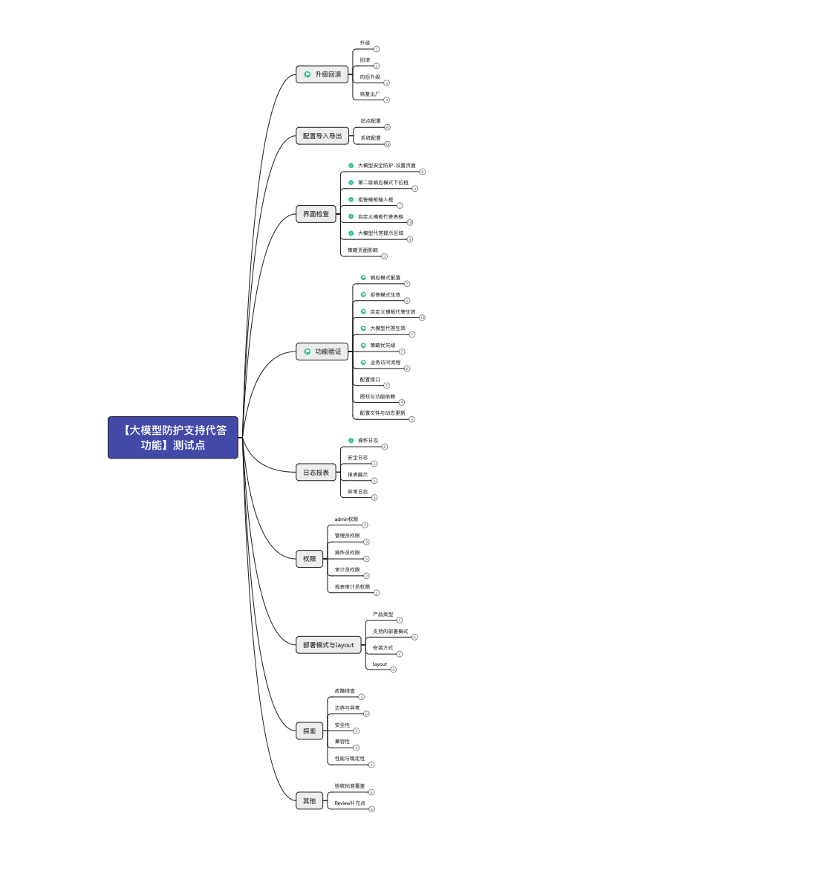

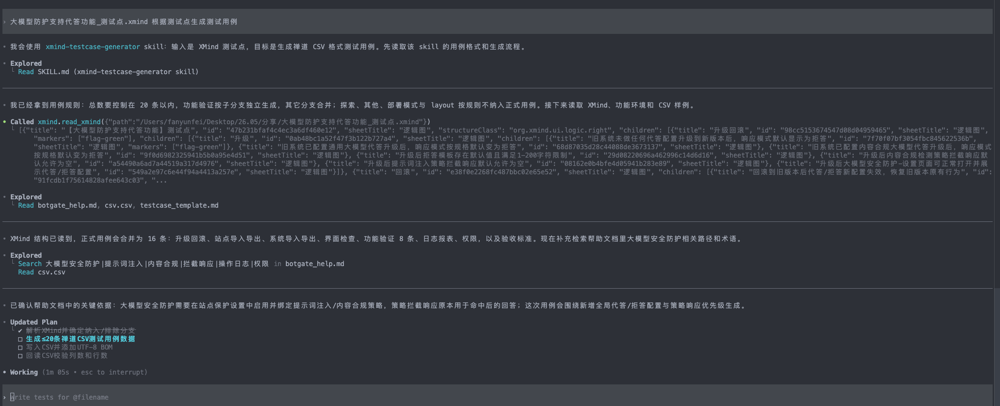  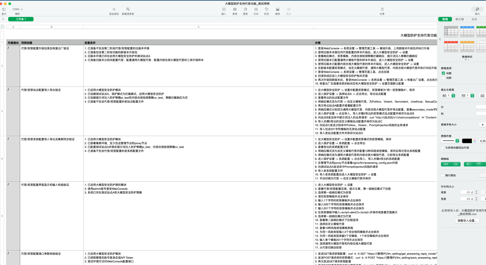


<!--  -->

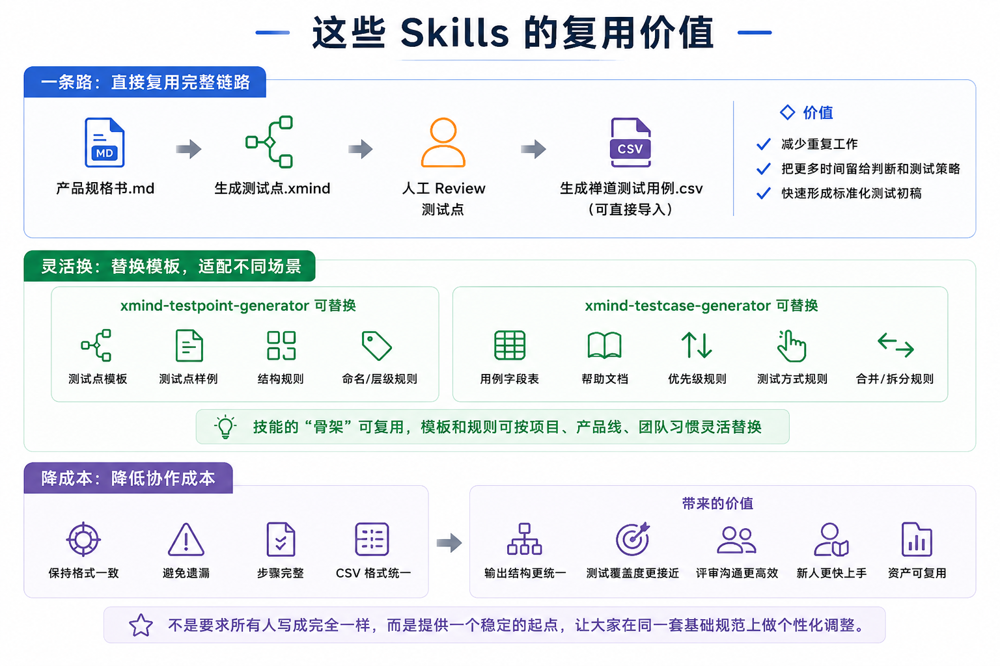

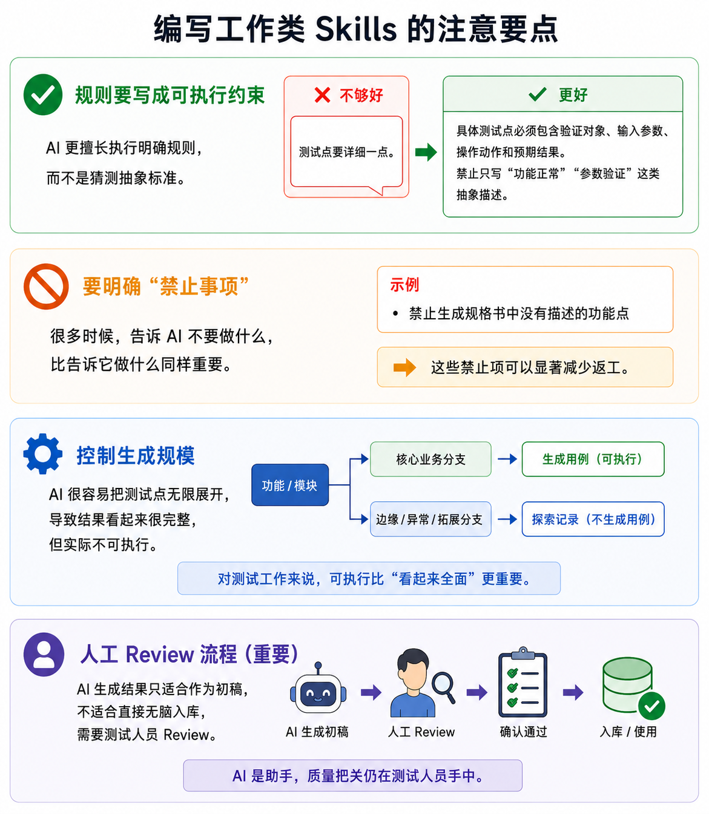

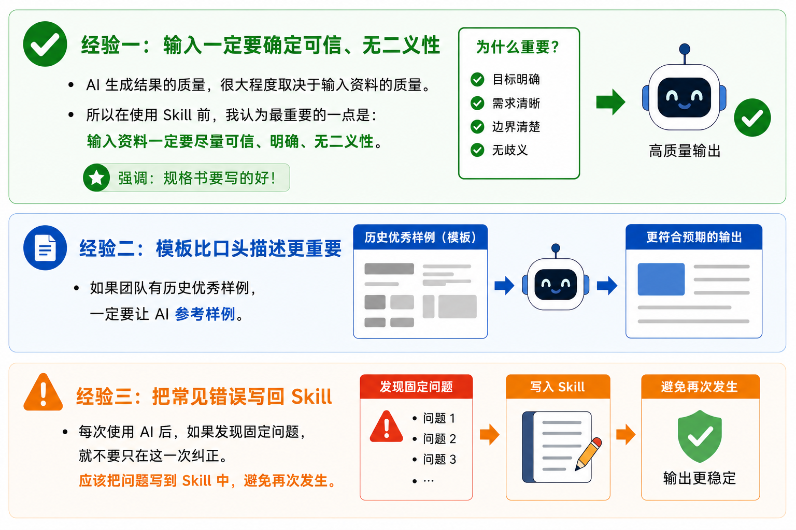

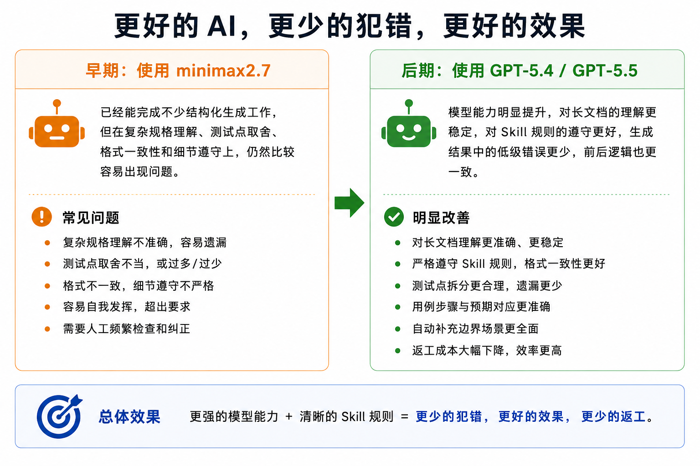

实例提示词：
```
我需要实现一个基于pytest的回放框架，回放样本源在http://10.10.8.250/DEV/LLM/llm_payload/llm_request.zip。里面存在两个文件夹，Black(黑样本)、White（白样本），文件夹里以一个文件为单位，每个文件里有一个完整请求，需要解析并回放；
能够配置回放目标ip 、端口、http/https,
检测到异常，响应会存在“抱歉，您的问题可能涉及敏感内容，无法回答。请更换其他话题。”提示信息
报告需要分别统计每个请求的实际与预期是否相同，需要统计响应码的情况；
包含需要包含json报告和支持jenkins统计的报告
```
对比

* MiniMax2.7


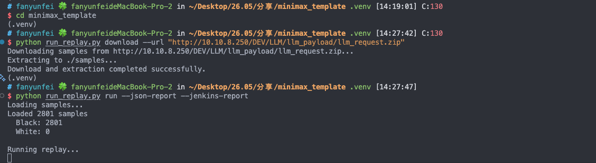

* GPT-5.5


<br>
<br>

# 题外话：订阅chatgpt plus

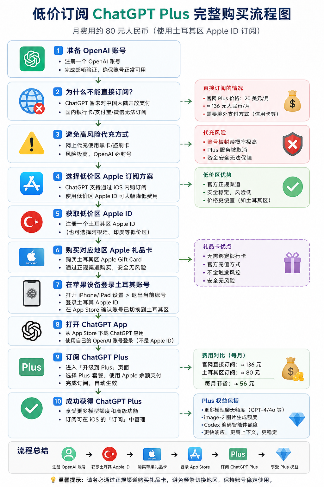
