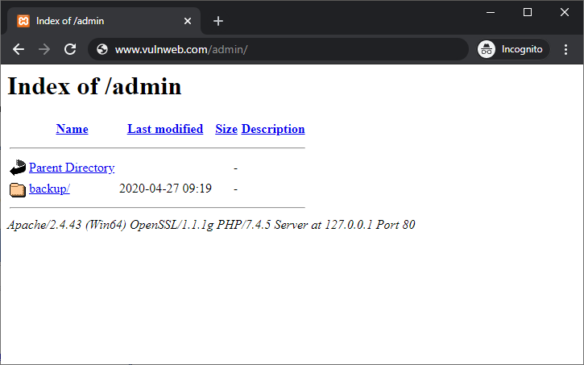
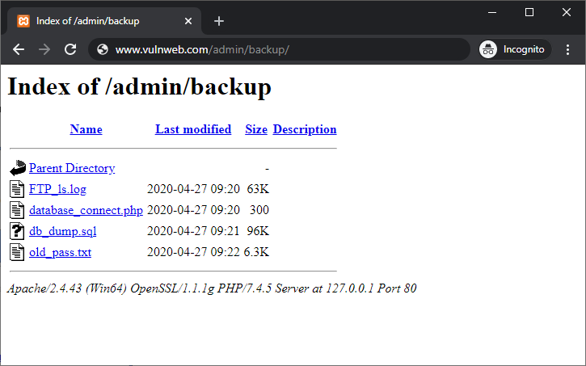

# 目录列表漏洞

### 什么是目录列表漏洞

目录列表是一项可能导致漏洞的 Web 服务器功能。 启用后，它显示没有索引文件的目录的内容。 应始终关闭此功能。 启用它是危险的，因为它会导致信息泄露。

### 目录列表如何工作
首先举个例子，当用户在浏览器地址栏中键入 www.test.com/learn/ 而不在 URL 中指定文件名（例如 index.html、index.php、index.htm 或 default.asp）时 ），Web 服务器处理此请求，返回该目录（在本例中为 /learn/ 目录）的索引 HTML 文件，并且 Web 浏览器显示网页。 但是，如果索引文件不存在并且启用了目录列表，则 Web 服务器将返回目录的内容，就像文件管理器一样。

### 为什么 Web 服务器管理员要打开目录列表

许多网络服务器管理员仍然遵循默默无闻的安全概念。 他们假设如果目录中没有指向文件的公共链接，则没有人可以访问它们。 这是不正确的，尤其是当启用目录列表并且黑帽黑客可以轻松找到目录中的所有文件时尤其不正确（事实上，甚至搜索引擎也可以索引此类目录）。 这就是为什么目录列表永远不应该打开的原因，尤其是在托管动态网站和 Web 应用程序时。

许多 Web 服务器默认启用目录列表的另一个原因是，为了方便起见，许多较旧的 Web 服务器版本默认启用了此功能。 当时网络安全不太受关注，访问权限也很宽松。 如今，大多数 Web 服务器发行版（无论是 Linux 还是 Windows）都默认关闭目录列表。

### 不带目录列表的目录浏览
即使在 Web 服务器上禁用目录列表，攻击者仍然可能发现并利用允许他们执行目录浏览的 Web 服务器漏洞。 例如，有一个旧的 Apache Tomcat 漏洞，其中对空字节 (%00) 和反斜杠 (\) 的不当处理使服务器容易受到目录列表攻击。

攻击者还可能使用在线数据库中包含的缓存或历史数据发现目录索引。 例如，Google 的缓存数据库可能包含以前启用目录列表的目标的历史数据，即使该功能现在已禁用。 此类数据使攻击者无需利用漏洞即可获取有用信息。

### 目录列表攻击示例
用户向 www.vulnweb.com/admin/ 发出网站请求。 服务器的响应包括目录 admin 的目录内容，如下面的屏幕截图所示。

从上面的目录列表中，您可以看到在 admin 目录中，有一个名为 backup 的子目录，其中可能包含足够的信息供攻击者发起攻击。

攻击者可以显示备份目录中的完整文件列表。 该目录包含密码文件、数据库文件、FTP 日志和 PHP 脚本等敏感文件。 显然，这些信息并不是供公众查看的。

Web 服务器配置错误导致文件列表泄露，并且数据已公开。 更糟糕的是，此类文件（例如 FTP 日志）可能包含其他敏感信息，其中可能包括用户名、IP 地址或 Web 托管操作系统的完整目录结构。