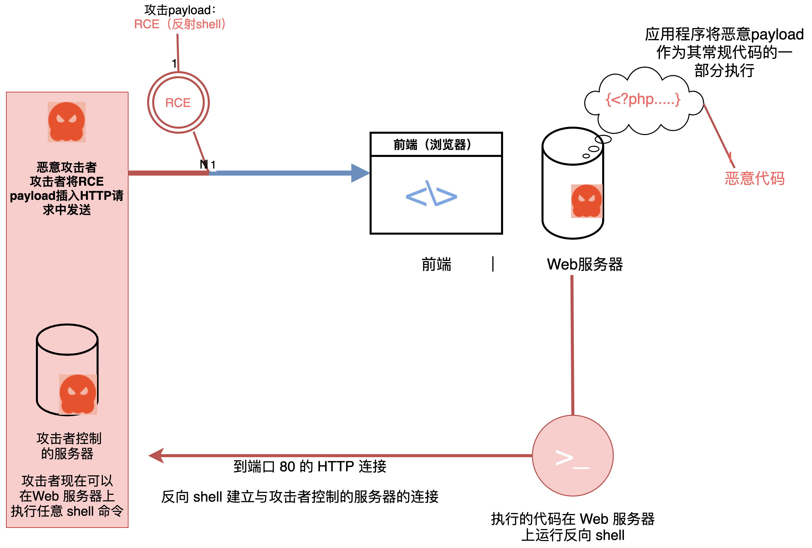

# 远程代码执行

### 什么是远程代码执行

`远程代码执行` (RCE) 是一种漏洞，可让恶意攻击者以开发人员编写该应用程序所用的编程语言执行任意代码。 术语`远程`意味着攻击者可以从不同于运行应用程序的系统的位置执行此操作。 `远程代码执行`也称为`代码注入`。

### 代码注入/远程代码执行如何进行

RCE 漏洞可能出现在任何类型的计算机软件、几乎所有编程语言和任何平台上。 例如，用 `C#`编写的独立 Windows 应用程序、用 PHP 编写的 Web 应用程序和 API、用 Java 编写的移动应用程序，甚至操作系统本身都存在 RCE 漏洞。

其他漏洞也可能导致远程任意代码执行。 例如，`C/C++` 等语言中的`缓冲区溢出漏洞`可能允许攻击者在应用程序中执行任意代码。 `反序列化漏洞`还可能允许攻击者提供一个负载，该负载在反序列化时包含应用程序执行的代码。 甚至还有已知的 SQL 注入和跨站点脚本 (XSS) 漏洞导致在易受攻击的应用程序中远程执行代码的案例

一些 RCE 攻击可能会延迟发生。 例如，应用程序可能首先将 RCE 负载存储在配置文件中，然后才执行它，甚至可能会执行多次。 这种类型的 RCE 漏洞称为`存储型RCE`。

请注意，`RCE`/`代码注入`经常与`操作系统命令注入`相混淆。 在 RCE 的情况下，执行的代码使用应用程序的语言并且在应用程序上下文中运行。 对于`操作系统命令注入`，攻击者执行的是操作系统命令。 

### Web 应用程序中的 RCE 漏洞

Web 开发中使用的每种常见编程语言都具有在运行时执行该语言代码的功能。 每当开发人员在 Web 应用程序中使用此类功能时，他们就会引入 Web 服务器端远程代码执行的可能性。 PHP 和 JavaScript 中此类函数的一个典型例子 `eval`。

如果开发人员允许诸如 `eval` 之类的函数处理未经过滤的用户输入，则恶意攻击者可能能够通过将代码包含在用户输入中来注入代码。 用户可控输入的常见场景包括 **Web 表单的文本**、**HTTP 标头的内容**、**用户上传的文件**，甚至是修改过的 **cookie**。

### Web 远程代码执行攻击示例

下面是一个简单的 PHP 源代码示例，其中就包含代码注入漏洞 (RCE)。

 

易受攻击的代码：

\<?php eval("echo ".$_GET["user"].";"); ?\>

开发人员假设用户只会提供一个有效的用户名作为 URL 的参数：

    http://www.example.com/index.php?user=admin

因此，应用程序将参数值填充到代码中，执行一下命令：

echo admin;

打印出用户名。

 

攻击向量
攻击者可以通过输入分号后跟有效负载来注入恶意代码。 分号使 `eval` 函数处理剩余的有效负载，就好像它是 PHP 中的新指令一样：

    http://www.example.com/index.php?user=admin;phpinfo();

结果，eval 函数执行代码：

    echo admin;
    phpinfo();

### Web RCE 攻击的潜在后果

远程代码执行是最严重的漏洞之一，因为 RCE 攻击的后果几乎是无限的，尤其是在 Web 应用程序的情况下。

攻击者利用 web RCE 漏洞进行的进一步最常见方式是安装 web shells。 这样的 RCE 漏洞有效载荷允许攻击者获得目标机器上的 shell 访问权限以运行系统命令。 该shell可能是一个反向shell，它能使攻击者避开大多数防火墙。

Web shell 具有与 Web 服务器相同的权限，通常是有限的。 然而，一旦攻击者获得了远程机器上的 shell 的访问权限，他们可能会尝试寻找其他漏洞并使用权限提升（privilege elevation）来获得 root 访问权限。

如果成功，攻击者将可以无限制地访问目标机器，并可能进行以下任何常见类型的攻击：

* 勒索软件或者其他恶意软件：攻击者可能会在机器上安装勒索软件，然后使用其他方法传播到受害者拥有的其他资产上。

* 窃取敏感数据：攻击者可能会使用权限提升来访问包含信用卡号等敏感数据的 SQL 数据库服务器。

* 加密货币挖掘：攻击者经常在受感染的机器上安装加密货币挖掘器。 挖矿会消耗您的计算资源，为网络犯罪分子提供进行更多恶意活动的资金。

### 使用反向 shell 的远程代码执行 (RCE)

 

### 如何防御远程代码执行 (RCE)

防止 Web 应用程序中的 RCE 漏洞的完全有效的方法是避免使用易受 RCE 影响的语言函数和结构以及不受信任的数据。 例如，PHP/JavaScript 中的 eval 函数。

如果您必须对不受信任的数据（直接或间接用户输入）使用 eval 函数，并且如果没有用户输入就无法实现您的应用程序目标，那么您必须接受您的代码容易受到远程代码执行攻击的风险。 即使有最好的输入校验，攻击者也可能总能找到一种方法来通过。

您可以通过基于白名单（而非黑名单）使用适当的输入/输出数据验证和清理来最大程度地降低攻击风险并减轻其后果。虽然在这种情况下您无法完全避免 RCE 漏洞。