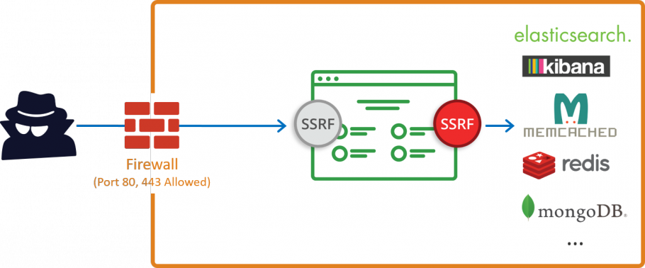

# 服务器端请求伪造 (SSRF)

### 什么是服务器端请求伪造 (SSRF)

服务器端请求伪造 (SSRF) 是一种漏洞，可让恶意攻击者从软件后端向另一台服务器或本地服务发送请求。 接收该请求的服务器或服务认为该请求来自可信应用程序并且是合法的。

 

### 服务器端请求伪造是如何进行的

当您构建网络软件时，您经常需要向其他服务器发出请求。 开发人员通常使用它们来获取远程资源，例如软件更新，或者从另一个应用程序导入元数据。 这样的请求一般来说并不危险，但如果实施不当，它们会使软件容易受到服务器端请求伪造的攻击。

当您使用用户输入数据创建请求时（例如，在构建 URL 时），可能会引入 SSRF 漏洞。 为执行 SSRF 攻击，攻击者随后可以更改易受攻击软件中的参数值，以创建或控制来自该软件并发送至其他服务器甚至同一台服务器的请求。

SSRF 漏洞可能出现在任何类型的计算机软件、几乎所有编程语言和任何平台上，只要该软件在网络环境中运行即可。 大多数 SSRF 漏洞发生在 Web 应用程序和其他网络应用程序中，但它们也可能出现在服务器软件本身中。

除了常规（非盲）SSRF 漏洞外，还有其他类型的 SSRF。 其中包括盲 SSRF 漏洞，攻击者不会直接从受攻击资源接收任何数据，但攻击者可以使用盲 SSRF 来触发他们只能从内部网络中触发的操作。

 

### Web 应用程序 SSRF 攻击示例

Web 应用程序中最常见的 SSRF 示例是攻击者可以输入或影响 Web 应用程序向第三方服务发出的请求 URL。

易受攻击的代码：
以下代码用于输出从另一个 URL 加载的 PNG 图像：

\<?php
  if (isset(\$_GET['url'])) {
    \$url = \$_GET['url'];
    \$image = fopen(\$url, 'rb');
    header("Content-Type: image/png");
    fpassthru(\$image);
  }
?\> 

请注意，攻击者可以完全控制 url 参数。 他们可以向任何外部 IP 发出任意 GET 请求，包括本地网络上的 IP，以及托管易受攻击应用程序 (localhost) 的服务器上的资源。

攻击向量
使用易受攻击的应用程序，攻击者可以向启用了 mod_status（这是默认配置）的 Apache Web 服务器发出以下请求：

    GET /?url=http://localhost/server-status HTTP/1.1

结果，攻击者收到有关服务器版本、已安装模块等的详细信息。 这有助于攻击者搜索更多潜在的漏洞。

 

除了 http 和 https URL 架构外，攻击者还可能在其有效payload中使用旧的 URL 架构（例如文件架构）来尝试访问本地系统或内部网络上的文件。

    GET /?url=file:///etc/passwd HTTP/1.1

此payload将为攻击者提供来自托管易受攻击应用程序的服务器上的 `/etc/passwd` 文件内容。

 

某些应用程序可能允许攻击者使用奇异的 URL 模式。 例如，如果应用程序使用 cURL 发出请求，攻击者可以使用 dict URL 架构向任何端口上的任何主机发出请求并发送自定义数据。

    GET /?url=dict://localhost:11211/stat HTTP/1.1

上述请求将导致应用链接到主机的11211端口并且发送字符串"stat"。 端口 11211 是 [Memcached](https://memcached.org/) 使用的默认端口（这个端口通常不会暴露给外部网络）。 但可以从本地主机访问，在本例中是通过 SSRF。

 

### SSRF 攻击的潜在后果

攻击者在尝试服务器端请求伪造攻击时，有两个主要目标：

- 访问特权资源：恶意黑客通常使用 SSRF 攻击以私有 IP 地址或位于防火墙后面的内部资源为目标，或者通过被利用服务器的环回接口 (http://127.0.0.1) 访问可用的服务。 例如，这可能包括 Azure/AWS 云服务元数据 (http://169.254.169.254)、内部 API，在某些情况下甚至是易受攻击服务器上的特权文件。 攻击者甚至可能使用 SSRF 进行本地端口扫描。

 

- 隐藏连接的真实来源：例如，攻击者可能会使用 SSRF，即使他们可以直接访问资源，只是为了掩盖他们的踪迹。 这样，访问尝试似乎源自易受 SSRF 攻击的本地应用程序的后端，而不是直接来自攻击者，这使得溯源更加麻烦。 攻击者还可能使用您易受攻击的服务器攻击其他人，从而使您的系统看起来像是实际攻击的源头。

 

由于这些原因，SSRF 利用通常是利用另一个漏洞之前的初步攻击步骤。 例如：

攻击者可能首先执行 SSRF 来访问位于另一台服务器上的关键业务应用程序，该应用程序只能从内部网络访问，然后使用 SQLi 来访问该业务应用程序背后的数据库。
攻击者还可能使用 SSRF 访问安装在托管具有远程代码执行 (RCE) 漏洞的应用程序的服务器上的本地应用程序，然后使用该应用程序获得完整的 shell 访问权限，然后利用操作系统漏洞获取 root 访问服务器。
因此，在最坏的情况下，如果 SSRF 与其他攻击向量（如 RCE、XXE、XSS、CSRF 或 SQLi）结合使用，则可能允许攻击者完全控制易受攻击的服务器或访问高度敏感的数据。

 

### 防止 SSRF 需要综合方法

以下组合方法将帮助您避免大多数 SSRF 漏洞，但您必须意识到它们并不完美，即使组合使用也是如此。 这就是为什么即使采用最佳安全编码实践也需要进行安全测试的原因。

白名单：您应该将您的应用程序需要访问的主机名（DNS 名称）或 IP 地址列入白名单。 然而，这种方法本身并不能阻止攻击者，例如，在白名单服务器上运行端口扫描或访问该服务器上的其他资源。

响应处理：如果您的应用程序显示或处理从其他服务器收到的数据，您必须确保收到的响应采用预期的格式。 您永远不应该将原始响应正文发送给客户端。 但是，这并不能防止盲目的 SSRF 攻击。

架构控制：如果您的应用程序仅使用 HTTP 或 HTTPS 发出请求，则仅允许这些 URL 架构。 如果禁用所有其他 URL 模式，攻击者将无法使用 Web 应用程序使用具有潜在危险的模式（例如文件、字典、ftp 和 gopher）发出请求。