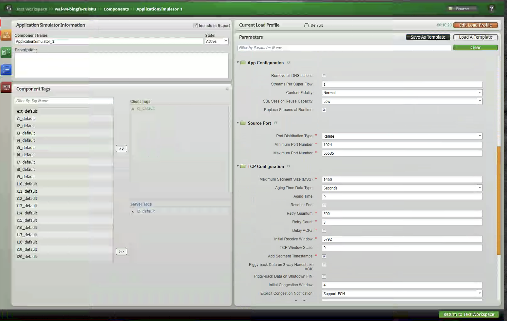
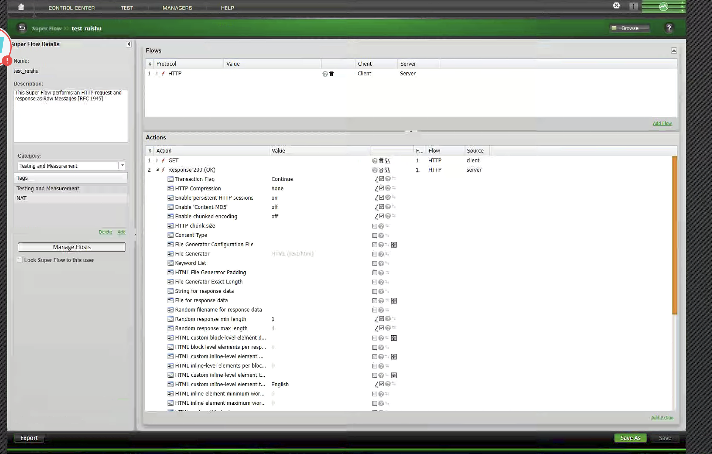
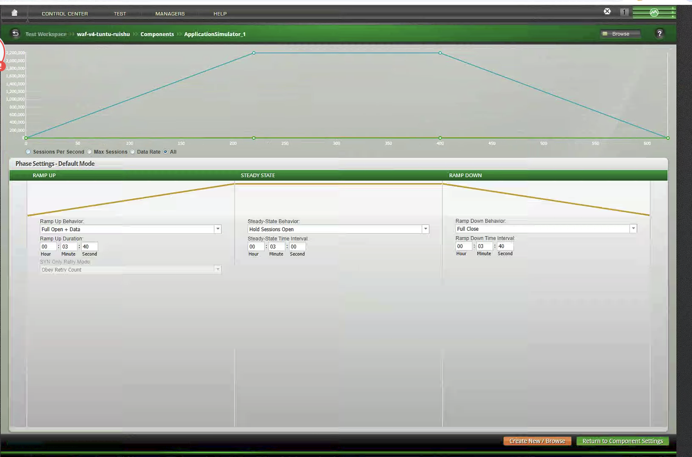
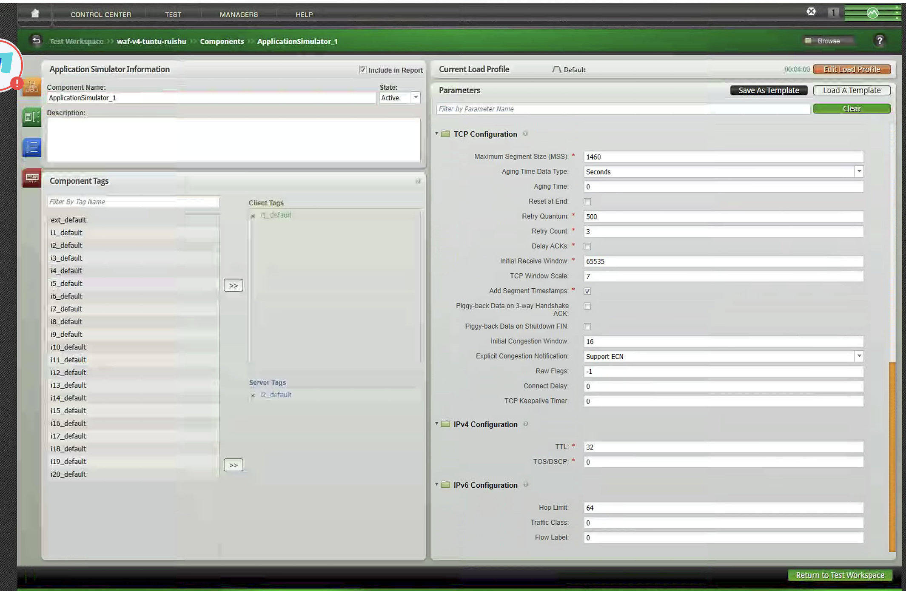
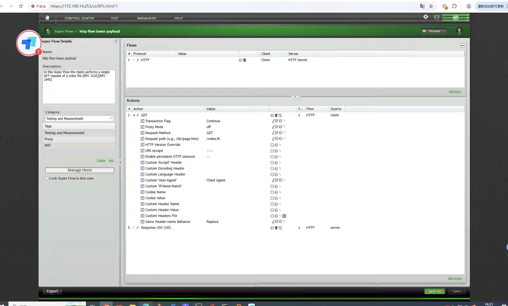
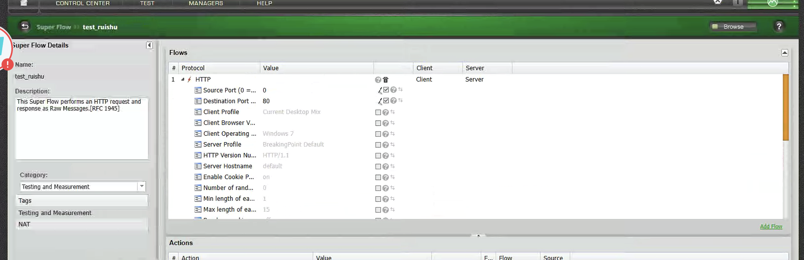
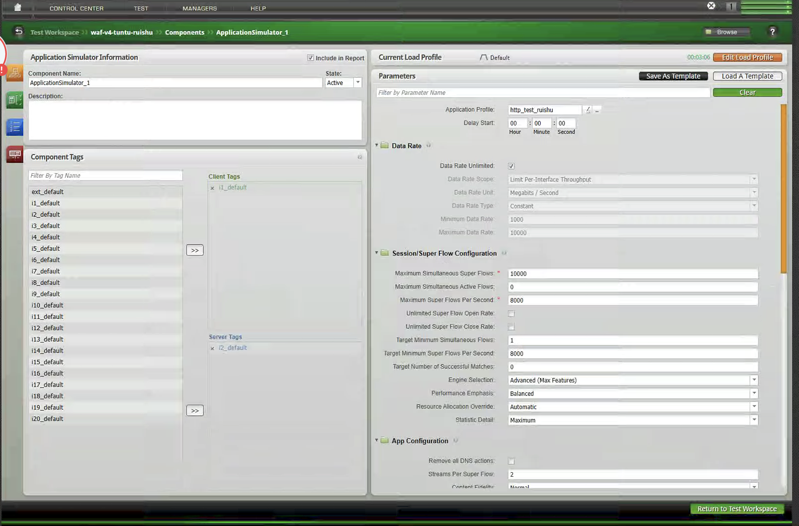
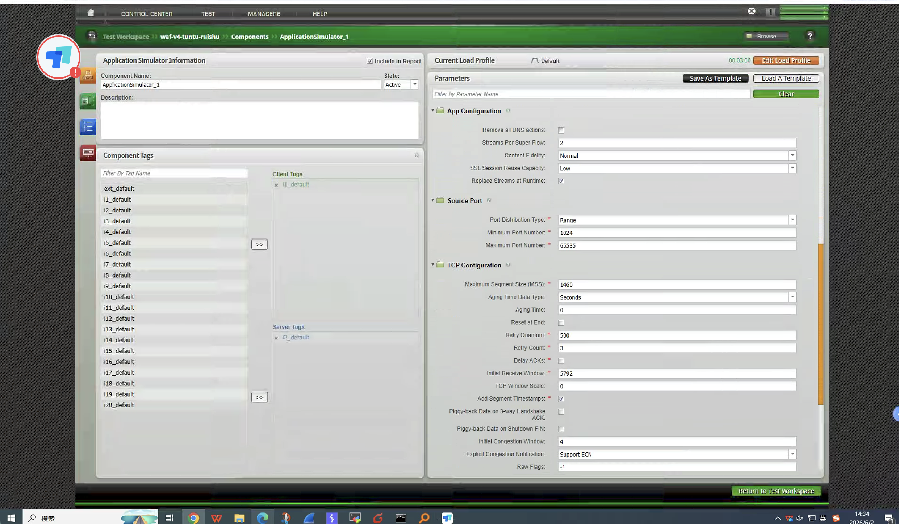

# 使用 BPS 进行性能测试：并发、吞吐与新建连接

在网络设备、WAF、负载均衡或安全网关的性能验证中，单看一个“性能值”很容易误判设备能力。BPS 的优势在于可以把应用流量、网络端点、TCP 参数和负载曲线组合起来，分别验证不同维度的瓶颈。

本文以一套典型 BPS 配置为例，将性能测试拆成三个常见场景：并发、吞吐、新建。三类测试使用相似的网络与应用组件，但测试目标、Super Flow、TCP 参数和 Load Profile 都有明显差异。

## 一、测试前的基础配置

### 1. 网络端点

在 Network Neighborhood 中，可以预先配置 20 个 Interface，并为每个 Interface 绑定 IPv4 Static Hosts。典型配置如下：

- Interface MTU 为 1500。
- Static Hosts 按 `i1_default`、`i2_default` 等标签组织。
- 外部目标主机使用 `192.168.100.220`，数量为 5。
- 客户端与服务端通过 Component Tags 绑定，例如 Client Tags 选择 `i1_default`，Server Tags 选择 `i2_default`。

这种设计的好处是，测试脚本不直接绑定具体端口或 IP，而是通过标签选择流量源和流量目标。后续切换拓扑、调整主机池或扩展接口时，不需要重写应用流。

### 2. 应用模拟器

三类测试都通过 `ApplicationSimulator_1` 发起应用流量。BPS 中的 Application Simulator 负责把网络端点、应用画像、Super Flow 和负载曲线组合起来。

一个完整的性能测试至少需要关注四类参数：

- 网络侧：接口、IP、网关、标签、MTU。
- 应用侧：HTTP 请求、响应、Header、响应体大小。
- 传输侧：源端口范围、MSS、TCP Window、Window Scale。
- 压力侧：最大并发、每秒 Super Flow、数据速率、升压/稳态/降压时长。

## 二、并发测试

### 1. 测试目标

并发测试关注设备能够同时保持多少条业务会话。它不是为了把带宽打满，而是为了验证设备在大量连接存在时的会话表容量、内存占用、连接保持能力以及长连接稳定性。

在并发场景中，可以把最大并发 Super Flow 设置为 `2200000`，也就是 220 万级别连接。应用响应体被压到非常小，目的是尽量减少吞吐压力，把测试重点集中到“连接是否能建起来并保持住”。

### 2. 关键配置

并发场景的 Application Profile 为 `http_test_ruishu`，主要参数如下：

| 配置项 | 配置值 | 说明 |
| --- | --- | --- |
| Data Rate Unlimited | 开启 | 不主动限制速率，由会话模型主导压力 |
| Maximum Simultaneous Super Flows | `2200000` | 最大并发会话目标 |
| Maximum Super Flows Per Second | `10000` | 每秒打开 Super Flow 上限 |
| Target Minimum Super Flows Per Second | `10000` | 目标每秒建流速率 |
| Streams Per Super Flow | `1` | 单个 Super Flow 内 1 条 Stream |
| Source Port Range | `1024-65535` | 使用大范围源端口 |
| MSS | `1460` | 标准以太网 MTU 下常见 MSS |
| Initial Receive Window | `5792` | 并发场景使用较小窗口 |
| TCP Window Scale | `0` | 不放大 TCP 窗口 |
| Initial Congestion Window | `4` | 保守的拥塞窗口 |

### 3. Super Flow 设计

并发测试使用轻量 HTTP 请求：

- 协议：HTTP。
- 客户端动作：`GET`。
- 服务端动作：`Response 200 OK`。
- 持久 HTTP Session：开启。
- 响应长度：最小 `1`，最大 `1`。
- 目标端口：`80`。
- HTTP 版本：`HTTP/1.1`。

这里的关键点是“小响应 + 保持连接”。如果响应体过大，测试会混入吞吐压力；如果连接快速关闭，测试会更接近新建连接能力，而不是并发保持能力。

### 4. Load Profile

并发测试采用三段式负载曲线：

| 阶段 | 行为 | 时长 |
| --- | --- | --- |
| Ramp Up | `Full Open + Data` | `3:40` |
| Steady State | `Hold Sessions Open` | `3:00` |
| Ramp Down | `Full Close` | `3:40` |

曲线表现为：会话数逐步爬升到约 220 万，稳态阶段保持不变，最后按降压时间释放。这个曲线适合观察设备在高并发稳态下是否出现会话丢失、异常关闭、CPU 或内存持续上涨。

### 5. 结果观察重点

并发测试建议重点看：

- Max Sessions 是否达到目标值。
- Established Sessions 是否稳定。
- Session Open/Close 是否异常抖动。
- DUT 的会话表、内存、CPU 是否稳定。
- 是否出现连接失败、重传、超时或异常关闭。

如果会话数上不去，优先检查源端口池、客户端 IP 数量、服务端 IP 数量、DUT 会话容量、NAT 端口复用策略和 BPS 端口资源。

## 三、吞吐测试

### 1. 测试目标

吞吐测试关注设备在业务流量下能转发多少数据。它验证的是带宽、包处理能力、TCP 大窗口传输能力和设备转发路径稳定性。

和并发测试不同，吞吐测试不需要制造百万级连接，而是通过较大的响应体和更适合大流量传输的 TCP 参数，把数据速率推高。

### 2. 关键配置

吞吐场景的 Application Profile 为 `00-weiwei-tuntu2`，主要参数如下：

| 配置项 | 配置值 | 说明 |
| --- | --- | --- |
| Data Rate Scope | `Limit Aggregate Throughput` | 按聚合吞吐控制 |
| Data Rate Unit | `Megabits / Second` | 以 Mbps 为单位 |
| Minimum Data Rate | `7000` | 最小吞吐目标 |
| Maximum Data Rate | `10000` | 最大吞吐目标 |
| Maximum Simultaneous Super Flows | `20000` | 并发连接规模较小 |
| Maximum Super Flows Per Second | `4000` | 每秒 Super Flow 上限 |
| Target Minimum Super Flows Per Second | `3000` | 目标每秒 Super Flow |
| Streams Per Super Flow | `1` | 单流模型 |
| Source Port Range | `1024-65535` | 大范围源端口 |
| MSS | `1460` | 标准 MSS |
| Initial Receive Window | `65535` | 提高接收窗口 |
| TCP Window Scale | `7` | 放大 TCP 窗口 |
| Initial Congestion Window | `16` | 提高初始发送能力 |

吞吐场景的 TCP 参数明显比并发场景更激进。`65535` 的接收窗口配合 Window Scale `7`，可以支持更大的在途数据量；Initial Congestion Window `16` 也有利于更快拉升带宽。

### 3. Super Flow 设计

吞吐测试使用较大 HTTP 响应：

- Super Flow：`http flow lower payload`。
- 客户端动作：`GET /video.fli`。
- 自定义 User-Agent：`Client Agent`。
- 服务端动作：`Response 200 OK`。
- Content-Type：`video/fli`。
- 响应长度：`524288` 字节。
- 持久 HTTP Session：开启。

这里使用 512 KB 左右的响应体，目的是让每条连接产生足够的数据传输。相比 1 字节响应，它更能模拟下载类、视频类或大对象传输场景，也更容易把设备转发链路压到目标吞吐。

### 4. Load Profile

吞吐测试总时长为 `4:00`：

| 阶段 | 行为 | 时长 |
| --- | --- | --- |
| Ramp Up | `Full Open + Data` | `0:30` |
| Steady State | `Open and Close Sessions` | `3:00` |
| Ramp Down | `Full Close` | `0:30` |

稳态阶段不是单纯保持连接，而是持续打开和关闭会话，同时维持数据传输。这种模型更接近真实业务里的连续请求，也能观察吞吐在连接变化下是否稳定。

### 5. 结果观察重点

吞吐测试建议重点看：

- 实际 Data Rate 是否稳定达到 `7000-10000 Mbps` 区间。
- 吞吐曲线是否平稳，是否出现周期性掉速。
- DUT CPU 是否达到瓶颈。
- 是否出现丢包、重传、乱序、TCP 零窗口。
- BPS 端口是否成为瓶颈。
- 应用成功率是否维持稳定。

如果吞吐上不去，应先区分是链路瓶颈、DUT 转发瓶颈、TCP 窗口不足、响应体太小，还是会话创建速率不足。吞吐测试不能只看 Mbps，也要同时看应用成功率和 TCP 层错误。

## 四、新建连接测试

### 1. 测试目标

新建连接测试关注设备每秒能处理多少新连接，也就是常说的 CPS 或新建会话能力。它主要验证 SYN 处理、会话表插入、策略匹配、NAT 分配、HTTP 首包处理和连接释放能力。

在新建场景中，目标可以设置为每秒 `8000` 条 Super Flow，并把最大同时存在的 Super Flow 控制在 `10000`。这说明它不追求长时间堆积大量连接，而是通过快速打开和关闭连接，持续制造建连压力。

### 2. 关键配置

新建场景的 Application Profile 为 `http_test_ruishu`，Super Flow 为 `http_test_xinjian`，主要参数如下：

| 配置项 | 配置值 | 说明 |
| --- | --- | --- |
| Data Rate Unlimited | 开启 | 不以带宽作为主要限制 |
| Maximum Simultaneous Super Flows | `10000` | 控制同时存在连接数量 |
| Maximum Super Flows Per Second | `8000` | 每秒新建目标 |
| Target Minimum Super Flows Per Second | `8000` | 稳态目标新建速率 |
| Streams Per Super Flow | `2` | 每个 Super Flow 包含 2 条 Stream |
| Source Port Range | `1024-65535` | 大范围源端口 |
| MSS | `1460` | 标准 MSS |
| Initial Receive Window | `5792` | 小窗口，降低吞吐干扰 |
| TCP Window Scale | `0` | 不放大窗口 |
| Initial Congestion Window | `4` | 保守发送 |

### 3. Super Flow 设计

新建连接测试使用轻量 HTTP 页面请求：

- Super Flow：`http_test_xinjian`。
- 客户端动作：`GET /index.html`。
- 服务端动作：`Response 200 OK`。
- Content-Type：`text/html`。
- 响应长度：最小 `1`，最大 `1`。
- Transaction Flag：`End`。
- 持久 HTTP Session：开启。

这里的响应长度同样被压到 1 字节，目的是减少数据传输时间，让连接可以更快完成请求、响应和释放，突出每秒建连能力。

### 4. Load Profile

新建连接测试的负载曲线非常短促：

| 阶段 | 行为 | 时长 |
| --- | --- | --- |
| Ramp Up | `Full Open` | `0:03` |
| Steady State | `Open and Close Sessions` | `3:00` |
| Ramp Down | `Full Close` | `0:03` |

按上述负载曲线执行时，预期表现是每秒 Super Flow 快速升到 `8000` 并保持，最大会话数约 `10000`。这种曲线适合直接打到目标 CPS，快速观察设备是否能稳定接住连接洪峰。

### 5. 结果观察重点

新建测试建议重点看：

- Super Flows Per Second 是否稳定达到 `8000`。
- TCP Connect 成功率是否稳定。
- HTTP Transaction 成功率是否稳定。
- DUT 是否出现 SYN backlog、会话表插入失败或端口耗尽。
- 失败连接是否集中出现在升压阶段。
- Ramp Down 后连接是否正常释放。

如果新建速率达不到目标，常见原因包括客户端 IP/源端口不足、DUT SYN 处理能力不足、策略路径过重、NAT 资源不足、服务端响应能力不足，或者 BPS 的端口资源配置不足。

## 五、三类测试的区别

| 测试类型 | 核心指标 | 典型配置特征 | Super Flow 特征 | 主要风险 |
| --- | --- | --- | --- | --- |
| 并发 | 最大同时会话数 | 大并发、长稳态、Hold Sessions Open | 小响应、连接保持 | 会话表、内存、长连接稳定性 |
| 吞吐 | Mbps/Gbps | 大响应、大 TCP 窗口、聚合吞吐限制 | `/video.fli`、512 KB 响应 | 转发性能、丢包、重传、CPU |
| 新建 | CPS/SFPS | 高 Super Flows Per Second、短升降压 | `/index.html`、1 字节响应、快速开闭 | SYN 处理、会话插入、端口/NAT 资源 |

简单来说：

- 并发测试看“能不能同时挂住这么多连接”。
- 吞吐测试看“能不能稳定转发这么多数据”。
- 新建测试看“能不能每秒创建这么多连接”。

三者不能互相替代。一个设备可能吞吐很高，但新建连接能力一般；也可能并发容量很大，但在大对象传输下无法维持高吞吐。因此性能测试报告中最好把三类指标分开呈现。

## 六、测试建议

1. 先跑小压力基线，确认路由、策略、NAT、服务端响应都正常，再逐步放大目标值。
2. 并发测试优先控制响应体大小，避免吞吐成为隐藏瓶颈。
3. 吞吐测试优先调整 TCP Window、Window Scale、响应体大小和 Data Rate Profile。
4. 新建测试优先关注源端口、客户端 IP 数量和连接释放速度。
5. 每次只调整一个关键参数，否则很难判断瓶颈来源。
6. BPS 侧统计和 DUT 侧统计要同时看，尤其是连接成功率、丢包、重传、CPU、内存和会话表。
7. 测试结果要记录完整配置，包括 Super Flow、Load Profile、网络标签、TCP 参数和目标值。

## 七、结论

BPS 做性能测试时，真正重要的不是把数值填大，而是让测试模型和指标目标一致。并发测试要减少载荷、保持连接；吞吐测试要放大响应体、优化 TCP 传输；新建测试要缩短事务、持续开闭连接。

只有把并发、吞吐、新建拆开测试，才能判断设备的真实性能边界，也才能在问题出现时快速定位瓶颈是在会话容量、转发链路，还是连接创建路径。

## 附录：参考图片

以下图片仅作为配置参考。正文已经保留完整说明和关键参数，不依赖图片也可以独立阅读。

### 网络配置

### 并发测试配置

### 吞吐测试配置

### 新建连接测试配置

