# 使用 BPS 进行性能测试：并发、吞吐与新建连接

在网络设备、WAF、负载均衡或安全网关的性能验证中，单看一个"性能值"很容易误判设备能力。BPS 的优势在于可以把应用流量、网络端点、TCP 参数和负载曲线组合起来，分别验证不同维度的瓶颈。

本文以一套典型 BPS 配置为例，将性能测试拆成三个常见场景：并发、吞吐、新建。三类测试使用相似的网络与应用组件，但测试目标、Super Flow、TCP 参数和 Load Profile 都有明显差异。

## 一、测试前的基础配置

### 1. 网络端点

在 Network Neighborhood 中，可以预先配置 20 个 Interface，并为每个 Interface 绑定 IPv4 Static Hosts。典型配置如下：

- Interface MTU 为 1500。
- Static Hosts 按 `i1_default`、`i2_default` 等标签组织。
- 外部目标主机使用 `192.168.100.220`，数量为 5。
- 客户端与服务端通过 Component Tags 绑定，例如 Client Tags 选择 `i1_default`，Server Tags 选择 `i2_default`。

这种设计的好处是，测试脚本不直接绑定具体端口或 IP，而是通过标签选择流量源和流量目标。后续切换拓扑、调整主机池或扩展接口时，不需要重写应用流。

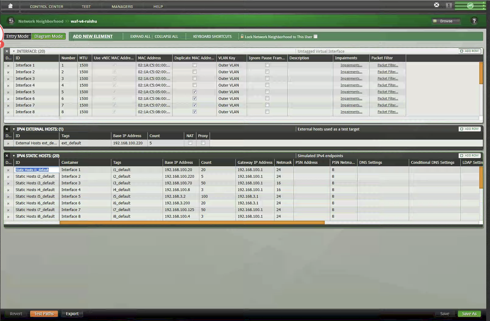

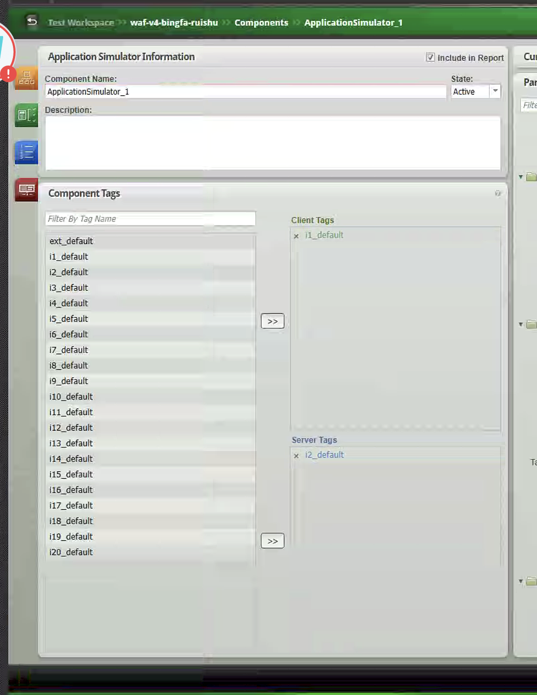

截图中的网络参数可以按三层理解：

| 参数 | 截图取值 | 参数作用 | 配置要点 |
| --- | --- | --- | --- |
| Interface | `Interface 1` 到 `Interface 20` | BPS 的虚拟测试接口，每个 Interface 可以承载一组客户端或服务端地址 | 性能测试要先确认流量从哪些端口进出，避免客户端和服务端标签绑到同一侧 |
| Number | `1`、`2`、`3` 等 | Interface 的序号 | 用于和物理端口、测试拓扑对应，排查流量方向时很关键 |
| MTU | `1500` | 二层最大传输单元 | 1500 对应常见以太网环境，后续 MSS 取 `1460` 正是基于 1500 MTU 扣除 IPv4/TCP 头部 |
| Use vNIC MAC Address | 勾选 | 使用虚拟网卡 MAC 地址 | 通常保持默认即可；如果 DUT 对 MAC 学习、ARP 或绑定策略敏感，需要确认该项 |
| MAC Address | `02:1A:C5:xx:00:...` | BPS 虚拟端点使用的源/目的 MAC | 多接口测试时要避免 MAC 冲突，否则会影响交换机或 DUT 的转发表 |
| Duplicate MAC Address | 部分接口勾选 | 是否允许重复 MAC | 只有在特定拓扑或仿真需求下使用；普通性能测试建议保持唯一 MAC |
| VLAN Key | `Outer VLAN` | VLAN 标识使用外层 VLAN | 如果链路启用了 VLAN/QinQ，需要和交换机、DUT 子接口配置一致 |
| Ignore Pause Frames | 未勾选 | 是否忽略以太网 PAUSE 帧 | 不忽略时，链路层流控可能影响吞吐结果；压测前要明确是否允许流控介入 |
| Impairments | `Impairments...` | 链路损伤配置入口 | 可模拟丢包、时延、抖动；本次性能基线测试通常不启用损伤 |
| Packet Filter | `Packet Filter...` | 报文过滤配置入口 | 用于限制或筛选特定报文，普通并发/吞吐/CPS 测试通常保持默认 |
| IPv4 External Hosts | `ext_default`，`192.168.100.220`，Count `5` | 外部真实目标主机或目标地址池 | 当 Server Tags 选择外部目标时，BPS 会把这些地址作为被测流量的服务端目标 |
| NAT / Proxy | 未勾选 | 是否按 NAT 或代理目标处理 | 如果 DUT 是 NAT、代理或反向代理设备，需要按真实路径选择 |
| IPv4 Static Hosts | `i1_default`、`i2_default` 等 | BPS 模拟的 IPv4 客户端/服务端地址池 | 这是性能测试的地址资源池，直接决定可用四元组数量和并发上限 |
| Container | `Interface 1`、`Interface 2` 等 | 静态地址池挂载在哪个 Interface 上 | Client Tags 和 Server Tags 必须落在正确接口，否则流量方向会错 |
| Tags | `i1_default`、`i2_default` 等 | 地址池的逻辑标签 | 后续 Application Simulator 不直接选 IP，而是通过标签选客户端和服务端 |
| Base IP Address | 如 `192.168.100.20`、`192.168.100.220`、`192.168.100.70` | 地址池起始 IP | Count 大于 1 时会从该地址开始连续生成多个端点 |
| Count | 如 `20`、`5`、`50`、`100` | 地址池数量 | 并发和新建测试中，Count 与源端口范围共同决定最大可用连接数 |
| Gateway IP Address | 如 `192.168.100.1`、`192.168.3.1` | BPS 发往跨网段目标时使用的网关 | 必须指向 DUT 或测试网关，否则 ARP/路由不通 |
| Netmask | 如 `24`、`16` | 地址池掩码 | 影响 BPS 判断目标是否同网段，以及是否走网关 |
| PSN Netmask | `8` | 平台内部网络掩码参数 | 一般保持默认，不作为业务性能调优重点 |

标签绑定截图中，`Client Tags` 选择 `i1_default`，`Server Tags` 选择 `i2_default`。这表示应用流量从 `i1_default` 对应的客户端地址池发起，访问 `i2_default` 对应的服务端地址池。后续三类测试都沿用这个思路：脚本绑定的是标签，不是单个 IP，所以扩展地址池时只要调整 Network Neighborhood，不需要重写 Super Flow。

### 2. 应用模拟器

三类测试都通过 `ApplicationSimulator_1` 发起应用流量。BPS 中的 Application Simulator 负责把网络端点、应用画像、Super Flow 和负载曲线组合起来。

一个完整的性能测试至少需要关注四类参数：

- 网络侧：接口、IP、网关、标签、MTU。
- 应用侧：HTTP 请求、响应、Header、响应体大小。
- 传输侧：源端口范围、MSS、TCP Window、Window Scale。
- 压力侧：最大并发、每秒 Super Flow、数据速率、升压/稳态/降压时长。

截图中的 Application Simulator 公共参数如下：

| 参数 | 截图取值 | 参数作用 | 配置要点 |
| --- | --- | --- | --- |
| Component Name | `ApplicationSimulator_1` | 当前应用模拟器组件名称 | 测试中可保留默认名；多个组件并行时建议改成能区分业务方向的名称 |
| State | `Active` | 组件是否参与测试执行 | 只有 Active 的组件才会发流；临时禁用某条业务流时可改为非 Active |
| Include in Report | 勾选 | 是否纳入报告 | 建议开启，方便报告里保留配置和统计 |
| Component Tags | `Client Tags: i1_default`，`Server Tags: i2_default` | 绑定客户端和服务端地址池 | 这是流量方向的核心参数，配错会导致流量不经过预期 DUT 路径 |
| Application Profile | 并发/新建为 `http_test_ruishu`，吞吐为 `00-weiwei-tuntu2` | 引用的应用画像 | 决定加载哪个 Super Flow、协议动作和业务模型 |
| Delay Start | `00:00:00` | 测试开始后延迟多久再启动该组件 | 多业务错峰压测时可使用；本例立即启动 |
| Current Load Profile | `Default` | 当前负载曲线模板 | 决定 Ramp Up、Steady State、Ramp Down 的行为和时长 |
| Data Rate Unlimited | 并发/新建截图勾选；吞吐截图保留速率字段 | 是否不按数据速率限流 | 并发和 CPS 测试通常开启，避免带宽成为主限制；吞吐测试若要严格控速，应确认该项与 Minimum/Maximum Data Rate 的生效关系 |
| Data Rate Scope | `Limit Per-Interface Throughput` 或 `Limit Aggregate Throughput` | 限速作用范围 | Per-Interface 按单接口限制，Aggregate 按组件总吞吐限制 |
| Data Rate Unit | `Megabits / Second` | 速率单位 | Mbps 适合 1G/10G 链路测试；报告中要说明是单向还是聚合吞吐 |
| Data Rate Type | `Constant` | 速率变化方式 | Constant 表示稳态目标固定，便于观察设备是否能持续承载 |
| Minimum Data Rate | 并发/新建 `1000`，吞吐 `7000` | 最小数据速率目标 | 在吞吐测试中用于定义期望下限；并发/CPS 场景不是主指标 |
| Maximum Data Rate | `10000` | 最大数据速率目标 | 用于限制最高发流速率，避免超过链路或设备预期 |
| Maximum Simultaneous Super Flows | 并发 `2200000`，吞吐 `20000`，新建 `10000` | 最大同时存在的 Super Flow 数 | 并发测试的核心指标；吞吐和新建测试中用于控制连接池规模 |
| Maximum Simultaneous Active Flows | `0` | 最大活跃 Flow 限制 | `0` 通常表示不额外限制，由 Super Flow 上限和负载曲线控制 |
| Maximum Super Flows Per Second | 并发 `10000`，吞吐 `4000`，新建 `8000` | 每秒最多启动多少个 Super Flow | 决定建流速度，是新建连接测试的核心参数 |
| Unlimited Super Flow Open Rate | 未勾选 | 是否取消打开 Super Flow 的速率限制 | 本例通过明确数值控压，避免瞬间冲击过大 |
| Unlimited Super Flow Close Rate | 未勾选 | 是否取消关闭 Super Flow 的速率限制 | 保持未勾选可让关闭过程跟随 Ramp Down 曲线 |
| Target Minimum Simultaneous Flows | `1` | 目标最小同时 Flow 数 | 防止稳态期间完全无流；本例不是主要压力参数 |
| Target Minimum Super Flows Per Second | 并发 `10000`，吞吐 `3000`，新建 `8000` | 期望达到的最低每秒 Super Flow 速率 | 低于该值说明发流、DUT 或服务端处理能力可能不足 |
| Target Number of Successful Matches | `0` | 目标成功匹配数量 | `0` 表示不以固定匹配次数作为停止条件 |
| Engine Selection | `Advanced (Max Features)` | BPS 引擎能力选择 | Max Features 更偏功能完整性，适合带 HTTP 解析和统计的测试 |
| Performance Emphasis | `Balanced` | 性能与功能的权衡模式 | Balanced 兼顾协议特性和性能；极限压测可根据平台能力另行评估 |
| Resource Allocation Override | `Automatic` | 资源分配策略 | 由 BPS 自动分配端口和引擎资源，普通测试建议保持自动 |
| Statistic Detail | `Maximum` | 统计详细程度 | Maximum 便于排查，但会增加统计开销；正式极限测试可对比低统计级别 |
| Remove all DNS actions | 未勾选 | 是否移除 Super Flow 中 DNS 动作 | 本例 HTTP 请求不依赖 DNS，保持默认即可 |
| Streams Per Super Flow | 并发/吞吐 `1`，新建 `2` | 每个 Super Flow 内包含的 Stream 数 | 1 更简单，便于测并发或吞吐；2 可让新建场景每个 Super Flow 包含更多事务动作 |
| Content Fidelity | `Normal` | 内容仿真保真度 | Normal 在真实性和性能之间折中 |
| SSL Session Reuse Capacity | `Low` | SSL 会话复用容量 | 本例是 HTTP，不是 HTTPS，该项影响不大 |
| Replace Streams at Runtime | 勾选 | 运行时替换 Stream | 允许测试期间动态替换流，保持默认即可 |

## 二、并发测试

### 1. 测试目标

并发测试关注设备能够同时保持多少条业务会话。它不是为了把带宽打满，而是为了验证设备在大量连接存在时的会话表容量、内存占用、连接保持能力以及长连接稳定性。

在并发场景中，可以把最大并发 Super Flow 设置为 `2200000`，也就是 220 万级别连接。应用响应体被压到非常小，目的是尽量减少吞吐压力，把测试重点集中到"连接是否能建起来并保持住"。

### 2. 关键配置

并发场景的 Application Profile 为 `http_test_ruishu`，主要参数如下：

| 配置项 | 配置值 | 说明 |
| --- | --- | --- |
| Data Rate Unlimited | 开启 | 不主动限制速率，由会话模型主导压力 |
| Maximum Simultaneous Super Flows | `2200000` | 最大并发会话目标 |
| Maximum Super Flows Per Second | `10000` | 每秒打开 Super Flow 上限 |
| Target Minimum Super Flows Per Second | `10000` | 目标每秒建流速率 |
| Streams Per Super Flow | `1` | 单个 Super Flow 内 1 条 Stream |
| Source Port Range | `1024-65535` | 使用大范围源端口 |
| MSS | `1460` | 标准以太网 MTU 下常见 MSS |
| Initial Receive Window | `5792` | 并发场景使用较小窗口 |
| TCP Window Scale | `0` | 不放大 TCP 窗口 |
| Initial Congestion Window | `4` | 保守的拥塞窗口 |

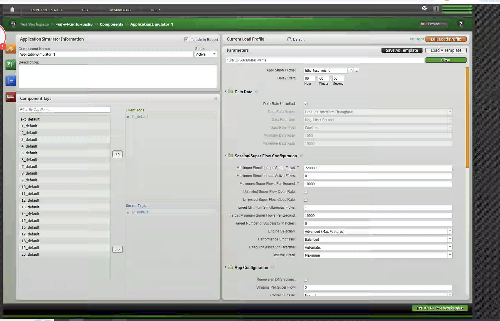

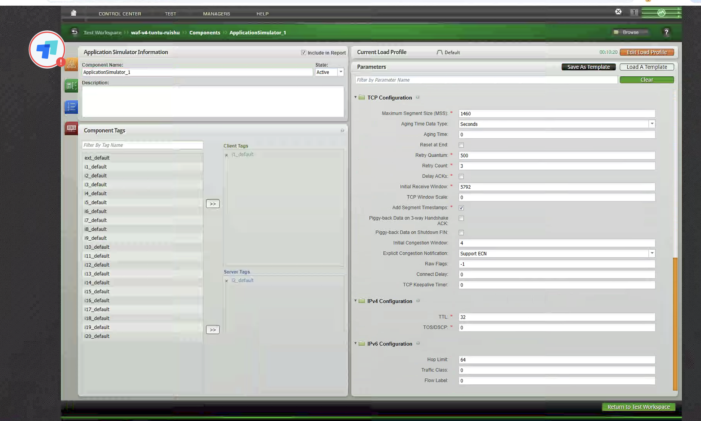

这些截图中的端口、TCP 和 IP 参数含义如下。吞吐场景与并发/新建场景的主要区别在 `Initial Receive Window`、`TCP Window Scale` 和 `Initial Congestion Window`。

| 参数 | 并发/新建取值 | 吞吐取值 | 参数作用 | 配置要点 |
| --- | --- | --- | --- | --- |
| Port Distribution Type | `Range` | `Range` | 源端口选择方式 | Range 表示从最小端口到最大端口范围内分配，适合大规模连接 |
| Minimum Port Number | `1024` | `1024` | 源端口池起始值 | 避开 0-1023 系统保留端口 |
| Maximum Port Number | `65535` | `65535` | 源端口池结束值 | 单个客户端 IP 理论上可提供约 6.4 万个源端口，实际还受目标 IP、目标端口、连接释放和 DUT 策略影响 |
| Maximum Segment Size (MSS) | `1460` | `1460` | TCP 单段最大载荷 | 1500 MTU 下 IPv4/TCP 常用 MSS，避免额外分片 |
| Aging Time Data Type | `Seconds` | `Seconds` | Aging Time 的单位 | 用秒表达连接老化时间 |
| Aging Time | `0` | `0` | BPS 侧连接老化时间 | `0` 表示不额外设置老化，连接生命周期主要由 Load Profile 和协议动作控制 |
| Reset at End | 未勾选 | 未勾选 | 测试结束是否用 RST 复位连接 | 未勾选时更接近正常关闭；若要快速清表可考虑 RST，但会改变 DUT 统计 |
| Retry Quantum | `500` | `500` | 重试时间粒度 | 影响连接失败后的重试节奏，过小可能放大瞬时压力 |
| Retry Count | `3` | `3` | 失败后的重试次数 | 过高会掩盖失败，过低会让短暂抖动直接暴露为失败 |
| Delay ACKs | 未勾选 | 未勾选 | 是否延迟 TCP ACK | 未启用可减少 ACK 延迟对测试结果的干扰 |
| Initial Receive Window | `5792` | `65535` | 初始 TCP 接收窗口 | 并发/新建使用较小窗口，降低数据面压力；吞吐使用较大窗口，提高在途数据量 |
| TCP Window Scale | `0` | `7` | TCP 窗口扩大因子 | 并发/新建不放大窗口；吞吐放大窗口，适合高带宽传输 |
| Add Segment Timestamps | 勾选 | 勾选 | TCP 时间戳选项 | 有助于 RTT/重传判断，也更接近现代 TCP 栈 |
| Piggy-back Data on 3-way Handshake ACK | 未勾选 | 未勾选 | 三次握手第三个 ACK 是否携带数据 | 未启用时握手和 HTTP 请求分离，更便于分析建连过程 |
| Piggy-back Data on Shutdown FIN | 未勾选 | 未勾选 | 关闭连接的 FIN 是否携带数据 | 未启用时关闭过程更清晰 |
| Initial Congestion Window | `4` | `16` | 初始拥塞窗口 | 并发/新建用 `4` 控制启动数据量；吞吐用 `16` 加快带宽拉升 |
| Explicit Congestion Notification | `Support ECN` | `Support ECN` | 是否支持 ECN 拥塞通知 | 支持 ECN 可以让设备标记拥塞而不必直接丢包，但是否生效取决于链路和 DUT |
| Raw Flags | `-1` | `-1` | 原始 TCP Flags 控制 | `-1` 通常表示使用默认协议栈行为，不手工覆写 Flags |
| Connect Delay | `0` | `0` | 建连前延迟 | `0` 表示无额外等待，压力由 Load Profile 控制 |
| TCP Keepalive Timer | `0` | `0` | TCP Keepalive 周期 | `0` 表示不额外启用 Keepalive，适合短时性能压测 |
| IPv4 TTL | `32` | `32` | IPv4 生存时间 | 一般足够覆盖测试拓扑；若跨多跳网络，需要确认不会被减到 0 |
| IPv4 TOS/DSCP | `0` | `0` | IPv4 服务质量标记 | `0` 表示不打 QoS 标记，避免被网络设备按优先级特殊处理 |
| IPv6 Hop Limit | `64` | `64` | IPv6 跳数限制 | 本例主要是 IPv4，该项保留默认 |
| IPv6 Traffic Class | `0` | `0` | IPv6 QoS 标记 | 本例不使用特殊 IPv6 QoS |
| IPv6 Flow Label | `0` | `0` | IPv6 Flow Label | 本例不使用 IPv6 流标签 |

### 3. Super Flow 设计

并发测试使用轻量 HTTP 请求：

- 协议：HTTP。
- 客户端动作：`GET`。
- 服务端动作：`Response 200 OK`。
- 持久 HTTP Session：开启。
- 响应长度：最小 `1`，最大 `1`。
- 目标端口：`80`。
- HTTP 版本：`HTTP/1.1`。

这里的关键点是"小响应 + 保持连接"。如果响应体过大，测试会混入吞吐压力；如果连接快速关闭，测试会更接近新建连接能力，而不是并发保持能力。

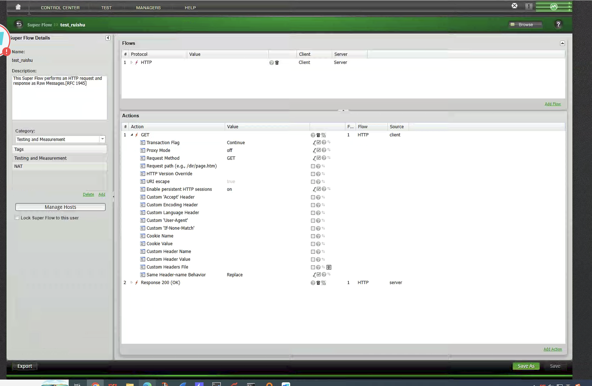

并发 Super Flow `test_ruishu` 的请求和响应参数说明如下：

| 参数 | 截图取值 | 参数作用 | 对并发测试的影响 |
| --- | --- | --- | --- |
| Super Flow Name | `test_ruishu` | Super Flow 名称 | 便于在 Application Profile 中引用 |
| Category | `Testing and Measurement` | 分类 | 用于管理和检索测试流 |
| Tags | `Testing and Measurement`、`NAT` | 标签 | 表示该流可用于测试计量和 NAT 场景 |
| Protocol | `HTTP` | 应用协议 | BPS 会按 HTTP 请求/响应模型生成事务 |
| Client | `Client` | 请求发起方 | 与 Application Simulator 的 Client Tags 对应 |
| Server | `Server` | 响应方 | 与 Server Tags 对应 |
| Source Port | `0` | 源端口 | `0` 表示由 Source Port Range 自动分配 |
| Destination Port | `80` | 目的端口 | 模拟普通 HTTP 服务 |
| Client Profile | `Current Desktop Mix` | 客户端画像 | 影响客户端 HTTP/TCP 行为的默认特征 |
| Client Operating System | `Windows 7` | 客户端操作系统画像 | 用于模拟特定终端协议栈特征 |
| Server Profile | `BreakingPoint Default` | 服务端画像 | 使用 BPS 默认服务端行为 |
| HTTP Version Number | `HTTP/1.1` | HTTP 版本 | 支持持久连接，适合并发保持 |
| Server Hostname | `default` | Host 名称 | 未指定真实域名时使用默认值 |
| Enable Cookie Processing | `on` | 是否处理 Cookie | 保持默认，不作为本次压力重点 |
| Transaction Flag | 请求 `Continue`，响应 `Continue` | 当前动作结束后是否继续后续事务 | 并发场景保持 Continue，有利于维持会话 |
| Proxy Mode | `off` | 是否按代理请求格式发送 | off 表示普通直连 HTTP 请求 |
| Request Method | `GET` | HTTP 方法 | GET 开销小，适合连接保持类测试 |
| Request path | 空/默认 | 请求 URI | 并发测试不依赖具体对象路径 |
| HTTP Version Override | 未启用 | 是否覆写 HTTP 版本 | 未启用时使用 Flow 基础 HTTP 版本 |
| URI escape | `true` | 是否对 URI 做转义 | 保持默认，避免特殊字符影响请求格式 |
| Enable persistent HTTP sessions | `on` | 是否启用 HTTP 长连接 | 并发测试的关键参数，连接不会在单次响应后立即关闭 |
| Custom Accept/Encoding/Language Header | 未启用 | 自定义请求头 | 不启用可减少请求复杂度 |
| Custom User-Agent | 未启用 | 自定义 User-Agent | 并发场景不需要特殊客户端标识 |
| Cookie Name / Cookie Value | 未启用 | Cookie 字段 | 本例不通过 Cookie 增加业务状态 |
| Custom Header Name / Value / File | 未启用 | 自定义 Header | 不启用可让每条请求更轻量 |
| Same Header-name Behavior | `Replace` | 同名 Header 的处理方式 | 出现同名 Header 时以后者替换前者，避免重复头膨胀 |
| HTTP Compression | `none` | 响应压缩方式 | 不压缩，避免压缩/解压影响设备性能判断 |
| Enable Content-MD5 | `off` | 是否生成 Content-MD5 | 关闭可减少额外计算和 Header |
| Enable chunked encoding | `off` | 是否使用分块编码 | 关闭后响应长度固定，统计更直观 |
| HTTP chunk size | 未设置 | 分块大小 | 未启用 chunked encoding 时不生效 |
| Content-Type | 未设置/默认 | 响应媒体类型 | 并发场景关注连接，不依赖内容类型 |
| File Generator Configuration File | 未设置 | 文件生成器配置 | 未使用外部文件生成规则 |
| File Generator | `HTML (text/html)` | 默认文件生成器 | 仅作为默认生成能力，实际响应长度由随机长度控制 |
| Keyword List | 未设置 | 关键词列表 | 本例不做关键字匹配 |
| HTML File Generator Padding | 未启用 | HTML 填充 | 不使用额外填充 |
| File Generator Exact Length | 未启用 | 是否精确按文件生成器长度 | 本例通过随机响应长度固定为 1 |
| String for response data | 未设置 | 固定响应字符串 | 不指定，减少内容相关变量 |
| File for response data | 未设置 | 使用外部文件作为响应体 | 不使用外部文件，避免磁盘/内容差异 |
| Random filename for response data | 未启用 | 随机文件名 | 不需要文件下载语义 |
| Random response min length | `1` | 响应体最小长度 | 把数据面压力降到最低 |
| Random response max length | `1` | 响应体最大长度 | 固定 1 字节响应，避免吞吐干扰并发指标 |

### 4. Load Profile

并发测试采用三段式负载曲线：

| 阶段 | 行为 | 时长 |
| --- | --- | --- |
| Ramp Up | `Full Open + Data` | `3:40` |
| Steady State | `Hold Sessions Open` | `3:00` |
| Ramp Down | `Full Close` | `3:40` |

曲线表现为：会话数逐步爬升到约 220 万，稳态阶段保持不变，最后按降压时间释放。这个曲线适合观察设备在高并发稳态下是否出现会话丢失、异常关闭、CPU 或内存持续上涨。

Load Profile 截图中的曲线和字段含义如下：

| 参数 | 并发取值 | 参数作用 | 说明 |
| --- | --- | --- | --- |
| Sessions Per Second | 曲线选项 | 每秒会话速率曲线 | 用于观察建连速度，和 `Maximum Super Flows Per Second` 相关 |
| Max Sessions | 曲线选项 | 最大会话数曲线 | 并发测试重点看这条线是否爬升到 `2200000` |
| Data Rate | 曲线选项 | 数据速率曲线 | 并发场景只作为辅助观察，不应成为主瓶颈 |
| All | 已选择 | 同时显示多个曲线 | 便于同时看会话数、速率和吞吐的关系 |
| Ramp Up Behavior | `Full Open + Data` | 升压阶段行为 | 一边建立连接一边传输数据，逐步把会话数推到目标 |
| Ramp Up Duration | `00:03:40` | 升压时长 | 220 秒内爬升到 220 万会话，平均约 1 万 Super Flow/s |
| SYN Only Retry Mode | `Obey Retry Count` | SYN 重试模式 | 建连失败时按 Retry Count 重试，而不是无限重试 |
| Steady-State Behavior | `Hold Sessions Open` | 稳态阶段行为 | 连接保持打开，是并发测试区别于新建测试的核心 |
| Steady-State Time Interval | `00:03:00` | 稳态时长 | 给 DUT 会话表、内存和 CPU 足够时间暴露稳定性问题 |
| Ramp Down Behavior | `Full Close` | 降压阶段行为 | 按正常关闭流程释放连接 |
| Ramp Down Time Interval | `00:03:40` | 降压时长 | 与升压对称，避免瞬间关闭造成额外冲击 |
| 总时长 | `00:10:20` | 整个测试运行时长 | 等于 3:40 + 3:00 + 3:40 |
| 图中蓝线 | 约 `2200000` | 最大会话曲线 | 应该在稳态保持水平，若下降说明会话保持失败或资源不足 |
| 图中绿/黄线 | 接近底部 | 速率或吞吐辅助曲线 | 并发场景响应体只有 1 字节，因此数据速率不会很高 |

### 5. 结果观察重点

并发测试建议重点看：

- Max Sessions 是否达到目标值。
- Established Sessions 是否稳定。
- Session Open/Close 是否异常抖动。
- DUT 的会话表、内存、CPU 是否稳定。
- 是否出现连接失败、重传、超时或异常关闭。

如果会话数上不去，优先检查源端口池、客户端 IP 数量、服务端 IP 数量、DUT 会话容量、NAT 端口复用策略和 BPS 端口资源。

## 三、吞吐测试

### 1. 测试目标

吞吐测试关注设备在业务流量下能转发多少数据。它验证的是带宽、包处理能力、TCP 大窗口传输能力和设备转发路径稳定性。

和并发测试不同，吞吐测试不需要制造百万级连接，而是通过较大的响应体和更适合大流量传输的 TCP 参数，把数据速率推高。

### 2. 关键配置

吞吐场景的 Application Profile 为 `00-weiwei-tuntu2`，主要参数如下：

| 配置项 | 配置值 | 说明 |
| --- | --- | --- |
| Data Rate Scope | `Limit Aggregate Throughput` | 按聚合吞吐控制 |
| Data Rate Unit | `Megabits / Second` | 以 Mbps 为单位 |
| Minimum Data Rate | `7000` | 最小吞吐目标 |
| Maximum Data Rate | `10000` | 最大吞吐目标 |
| Maximum Simultaneous Super Flows | `20000` | 并发连接规模较小 |
| Maximum Super Flows Per Second | `4000` | 每秒 Super Flow 上限 |
| Target Minimum Super Flows Per Second | `3000` | 目标每秒 Super Flow |
| Streams Per Super Flow | `1` | 单流模型 |
| Source Port Range | `1024-65535` | 大范围源端口 |
| MSS | `1460` | 标准 MSS |
| Initial Receive Window | `65535` | 提高接收窗口 |
| TCP Window Scale | `7` | 放大 TCP 窗口 |
| Initial Congestion Window | `16` | 提高初始发送能力 |

吞吐场景的 TCP 参数明显比并发场景更激进。`65535` 的接收窗口配合 Window Scale `7`，可以支持更大的在途数据量；Initial Congestion Window `16` 也有利于更快拉升带宽。

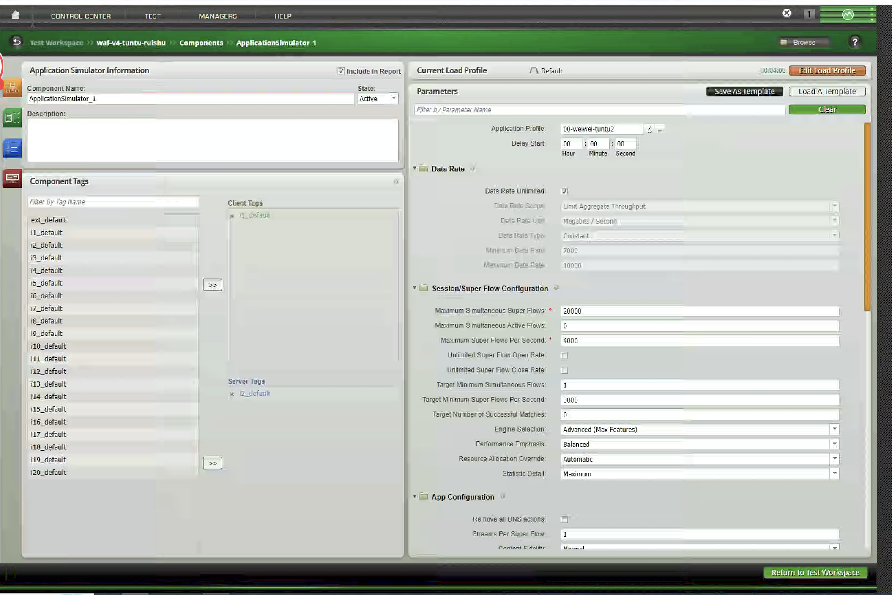

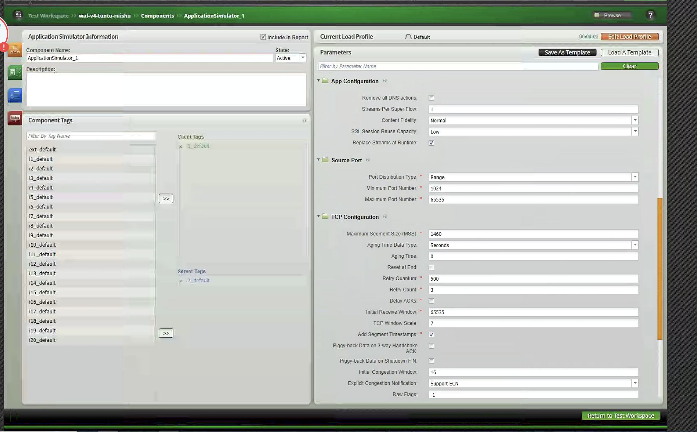

### 3. Super Flow 设计

吞吐测试使用较大 HTTP 响应：

- Super Flow：`http flow lower payload`。
- 客户端动作：`GET /video.fli`。
- 自定义 User-Agent：`Client Agent`。
- 服务端动作：`Response 200 OK`。
- Content-Type：`video/fli`。
- 响应长度：`524288` 字节。
- 持久 HTTP Session：开启。

这里使用 512 KB 左右的响应体，目的是让每条连接产生足够的数据传输。相比 1 字节响应，它更能模拟下载类、视频类或大对象传输场景，也更容易把设备转发链路压到目标吞吐。

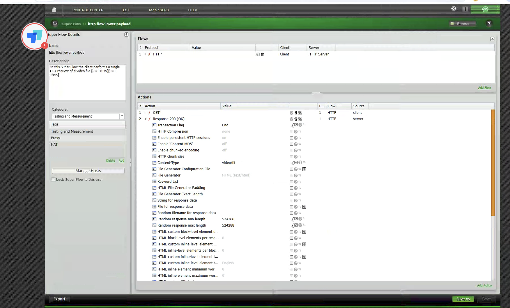

吞吐 Super Flow `http flow lower payload` 与并发流的字段大体一致，但以下参数发生了关键变化：

| 参数 | 截图取值 | 参数作用 | 对吞吐测试的影响 |
| --- | --- | --- | --- |
| Super Flow Name | `http flow lower payload` | Super Flow 名称 | 明确这是低层载荷/大对象传输类 HTTP 流 |
| Description | 单次 GET 视频文件请求 | 流量模型描述 | 说明该流用于模拟下载视频文件 |
| Tags | `Testing and Measurement`、`Proxy`、`NAT` | 分类标签 | 可用于代理、NAT 路径下的吞吐测试 |
| Protocol | `HTTP` | 应用协议 | 通过 HTTP 事务承载大响应体 |
| Server | `HTTP Server` | 服务端角色 | 与并发/新建截图中的 `Server` 命名不同，但作用相同 |
| Request Method | `GET` | HTTP 方法 | 下载对象通常使用 GET |
| Request path | `/video.fli` | 请求对象路径 | 让测试语义更接近视频/文件下载 |
| Custom User-Agent | `Client Agent` | 自定义 User-Agent | 可用于模拟特定客户端或让 DUT 策略命中 User-Agent 条件 |
| Same Header-name Behavior | `Replace` | 同名 Header 处理 | 避免重复 Header 导致请求膨胀 |
| Response Transaction Flag | `End` | 响应后结束当前事务 | 每次大对象传输完成后事务结束，配合 Load Profile 持续开闭会话 |
| HTTP Compression | `none` | 响应压缩 | 不压缩，确保链路上真实承载 512 KB 级响应体 |
| Enable persistent HTTP sessions | `on` | HTTP 长连接 | 允许连接复用，减少纯建连开销对吞吐的干扰 |
| Enable Content-MD5 | `off` | 内容校验 Header | 关闭后减少额外计算和 Header |
| Enable chunked encoding | `off` | 分块传输 | 固定 Content-Length 模型更利于吞吐统计 |
| Content-Type | `video/fli` | 响应媒体类型 | 模拟视频文件传输 |
| File Generator | `HTML (text/html)` | 默认生成器 | 虽显示 HTML 默认生成器，但实际关键是响应长度固定为 524288 |
| Random response min length | `524288` | 响应体最小长度 | 每次响应至少 512 KB |
| Random response max length | `524288` | 响应体最大长度 | 最小值等于最大值，确保每次响应大小固定 |

吞吐场景真正拉高带宽的是三组配置组合：响应体 `524288` 字节、TCP 窗口 `65535` 加 Window Scale `7`、以及 Initial Congestion Window `16`。如果只把 Super Flows Per Second 调高，但响应体仍是 1 字节，测试结果会更像 CPS，而不是吞吐。

### 4. Load Profile

吞吐测试总时长为 `4:00`：

| 阶段 | 行为 | 时长 |
| --- | --- | --- |
| Ramp Up | `Full Open + Data` | `0:30` |
| Steady State | `Open and Close Sessions` | `3:00` |
| Ramp Down | `Full Close` | `0:30` |

稳态阶段不是单纯保持连接，而是持续打开和关闭会话，同时维持数据传输。这种模型更接近真实业务里的连续请求，也能观察吞吐在连接变化下是否稳定。

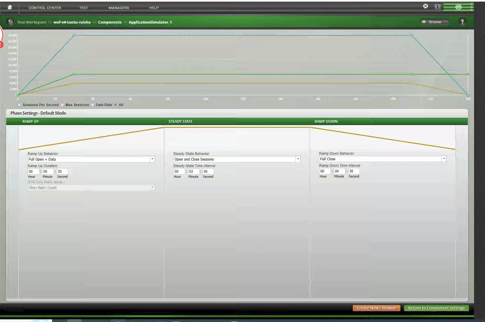

吞吐 Load Profile 的字段解释如下：

| 参数 | 吞吐取值 | 参数作用 | 说明 |
| --- | --- | --- | --- |
| Ramp Up Behavior | `Full Open + Data` | 升压阶段边建连边传输 | 30 秒内把会话、速率和吞吐拉到目标区间 |
| Ramp Up Duration | `00:00:30` | 升压时长 | 比并发短，因为目标会话数只有 `20000` |
| Steady-State Behavior | `Open and Close Sessions` | 稳态持续打开和关闭会话 | 更接近真实下载业务中的连续请求，而不是单纯保持长连接 |
| Steady-State Time Interval | `00:03:00` | 稳态时长 | 用于观察 7-10 Gbps 目标区间能否稳定保持 |
| Ramp Down Behavior | `Full Close` | 降压关闭连接 | 结束时正常释放连接 |
| Ramp Down Time Interval | `00:00:30` | 降压时长 | 30 秒内完成释放 |
| 总时长 | `00:04:00` | 整体测试时间 | 等于 0:30 + 3:00 + 0:30 |
| 图中蓝线 | 约 `20000` | 最大会话曲线 | 吞吐测试不追求百万并发，保持 2 万级连接即可 |
| 图中绿线 | 约 `7000` | 数据速率或目标下限曲线 | 对应 Minimum Data Rate `7000 Mbps` |
| 图中黄线 | 约 `4000` | 每秒 Super Flow 曲线 | 对应 Maximum Super Flows Per Second `4000` |

### 5. 结果观察重点

吞吐测试建议重点看：

- 实际 Data Rate 是否稳定达到 `7000-10000 Mbps` 区间。
- 吞吐曲线是否平稳，是否出现周期性掉速。
- DUT CPU 是否达到瓶颈。
- 是否出现丢包、重传、乱序、TCP 零窗口。
- BPS 端口是否成为瓶颈。
- 应用成功率是否维持稳定。

如果吞吐上不去，应先区分是链路瓶颈、DUT 转发瓶颈、TCP 窗口不足、响应体太小，还是会话创建速率不足。吞吐测试不能只看 Mbps，也要同时看应用成功率和 TCP 层错误。

## 四、新建连接测试

### 1. 测试目标

新建连接测试关注设备每秒能处理多少新连接，也就是常说的 CPS 或新建会话能力。它主要验证 SYN 处理、会话表插入、策略匹配、NAT 分配、HTTP 首包处理和连接释放能力。

在新建场景中，目标可以设置为每秒 `8000` 条 Super Flow，并把最大同时存在的 Super Flow 控制在 `10000`。这说明它不追求长时间堆积大量连接，而是通过快速打开和关闭连接，持续制造建连压力。

### 2. 关键配置

新建场景的 Application Profile 为 `http_test_ruishu`，Super Flow 为 `http_test_xinjian`，主要参数如下：

| 配置项 | 配置值 | 说明 |
| --- | --- | --- |
| Data Rate Unlimited | 开启 | 不以带宽作为主要限制 |
| Maximum Simultaneous Super Flows | `10000` | 控制同时存在连接数量 |
| Maximum Super Flows Per Second | `8000` | 每秒新建目标 |
| Target Minimum Super Flows Per Second | `8000` | 稳态目标新建速率 |
| Streams Per Super Flow | `2` | 每个 Super Flow 包含 2 条 Stream |
| Source Port Range | `1024-65535` | 大范围源端口 |
| MSS | `1460` | 标准 MSS |
| Initial Receive Window | `5792` | 小窗口，降低吞吐干扰 |
| TCP Window Scale | `0` | 不放大窗口 |
| Initial Congestion Window | `4` | 保守发送 |

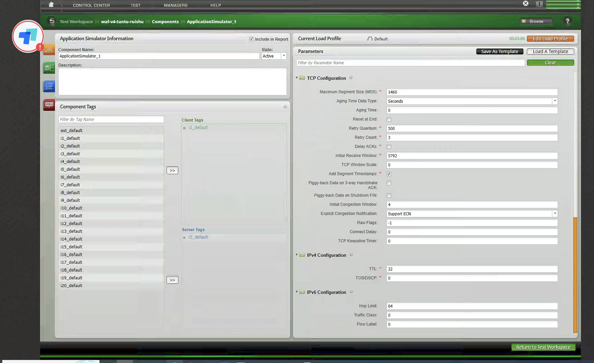

### 3. Super Flow 设计

新建连接测试使用轻量 HTTP 页面请求：

- Super Flow：`http_test_xinjian`。
- 客户端动作：`GET /index.html`。
- 服务端动作：`Response 200 OK`。
- Content-Type：`text/html`。
- 响应长度：最小 `1`，最大 `1`。
- Transaction Flag：`End`。
- 持久 HTTP Session：开启。

这里的响应长度同样被压到 1 字节，目的是减少数据传输时间，让连接可以更快完成请求、响应和释放，突出每秒建连能力。

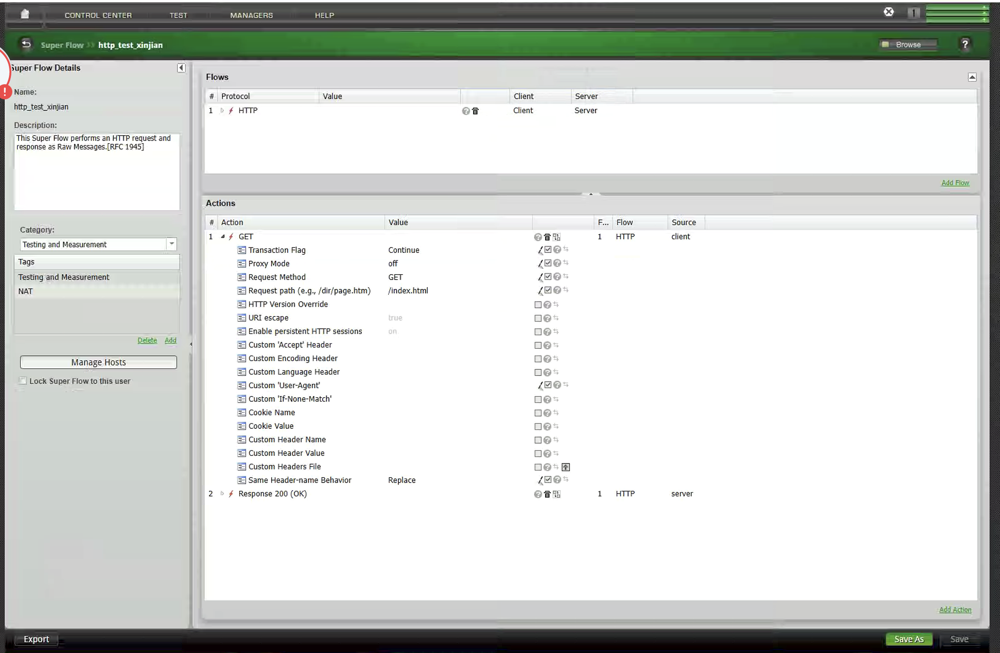

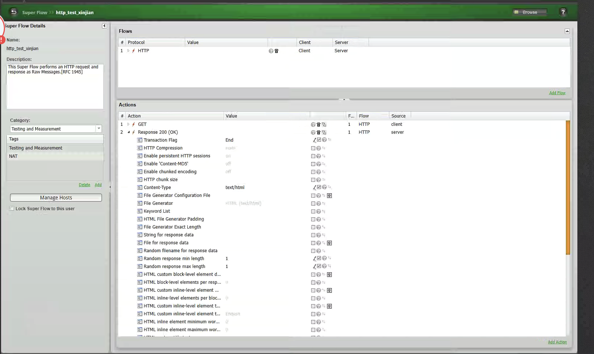

新建 Super Flow `http_test_xinjian` 与并发流同样是轻量 HTTP，但它明确配置了请求路径和事务结束行为：

| 参数 | 截图取值 | 参数作用 | 对新建测试的影响 |
| --- | --- | --- | --- |
| Super Flow Name | `http_test_xinjian` | Super Flow 名称 | 作为新建连接测试的专用 HTTP 流 |
| Tags | `Testing and Measurement`、`NAT` | 标签 | 适合在 NAT 或安全网关路径下测 CPS |
| Protocol | `HTTP` | 应用协议 | 每条连接完成一个轻量 HTTP 事务 |
| Request Method | `GET` | HTTP 方法 | 请求开销小，便于提高 CPS |
| Request path | `/index.html` | 请求对象路径 | 模拟访问首页或小页面 |
| Transaction Flag | 请求 `Continue`，响应 `End` | 事务控制 | 请求后继续到响应，响应后结束事务，便于快速进入下一次开闭连接 |
| Proxy Mode | `off` | 代理模式 | 普通直连 HTTP |
| URI escape | `true` | URI 转义 | 保持默认，保证请求格式规范 |
| Enable persistent HTTP sessions | `on` | HTTP 长连接 | 虽然开启长连接，但 Load Profile 采用 Open and Close Sessions，因此整体仍体现持续新建能力 |
| Custom User-Agent | 已启用但未见具体值 | 自定义 User-Agent | 可用于触发 DUT 中与客户端标识相关的策略；若不需要策略匹配，可保持为空或默认 |
| Same Header-name Behavior | `Replace` | 同名 Header 处理 | 保持请求头简洁 |
| Response Transaction Flag | `End` | 响应后结束事务 | 新建连接测试的关键，让事务快速完成并进入关闭/下一次新建 |
| HTTP Compression | `none` | 响应压缩 | 不引入压缩计算 |
| Enable Content-MD5 | `off` | 内容 MD5 | 降低响应生成开销 |
| Enable chunked encoding | `off` | 分块传输 | 固定短响应更利于 CPS |
| Content-Type | `text/html` | 响应类型 | 模拟普通 HTML 页面 |
| Random response min length | `1` | 响应体最小长度 | 最小化数据传输 |
| Random response max length | `1` | 响应体最大长度 | 固定 1 字节，突出建连和释放能力 |

### 4. Load Profile

新建连接测试的负载曲线非常短促：

| 阶段 | 行为 | 时长 |
| --- | --- | --- |
| Ramp Up | `Full Open` | `0:03` |
| Steady State | `Open and Close Sessions` | `3:00` |
| Ramp Down | `Full Close` | `0:03` |

按上述负载曲线执行时，预期表现是每秒 Super Flow 快速升到 `8000` 并保持，最大会话数约 `10000`。这种曲线适合直接打到目标 CPS，快速观察设备是否能稳定接住连接洪峰。

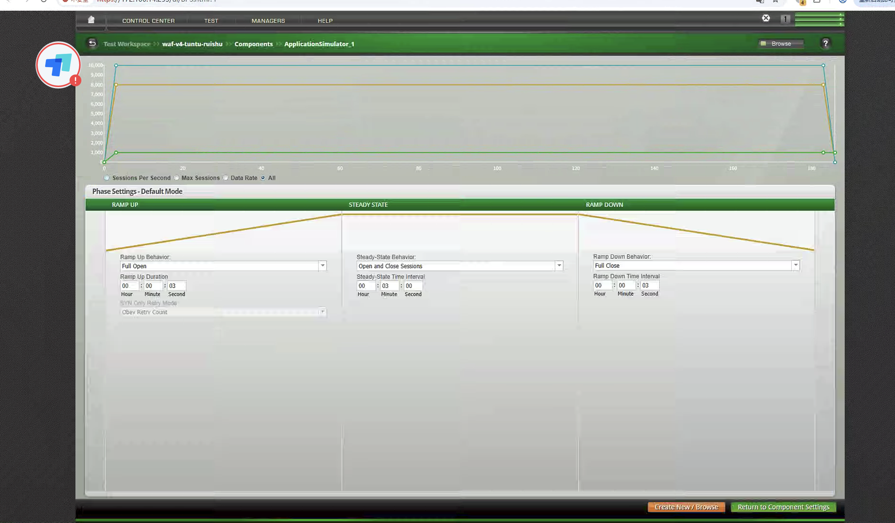

新建 Load Profile 的字段解释如下：

| 参数 | 新建取值 | 参数作用 | 说明 |
| --- | --- | --- | --- |
| Ramp Up Behavior | `Full Open` | 升压阶段只快速打开连接 | 不强调升压期间传输大量数据，重点是尽快达到 CPS 目标 |
| Ramp Up Duration | `00:00:03` | 升压时长 | 3 秒内拉到 `8000` Super Flows/s，属于非常陡的压力曲线 |
| SYN Only Retry Mode | `Obey Retry Count` | SYN 重试模式 | 建连失败按 TCP Retry Count 控制 |
| Steady-State Behavior | `Open and Close Sessions` | 稳态持续开闭连接 | 新建连接测试的核心行为 |
| Steady-State Time Interval | `00:03:00` | 稳态时长 | 持续 3 分钟观察 DUT 每秒建连能力是否稳定 |
| Ramp Down Behavior | `Full Close` | 降压阶段关闭连接 | 正常释放连接资源 |
| Ramp Down Time Interval | `00:00:03` | 降压时长 | 3 秒内完成快速降压 |
| 总时长 | `00:03:06` | 整体测试时间 | 等于 0:03 + 3:00 + 0:03 |
| 图中蓝线 | 约 `10000` | 最大会话曲线 | 对应 Maximum Simultaneous Super Flows `10000` |
| 图中黄线 | 约 `8000` | 每秒 Super Flow 曲线 | 对应 CPS/SFPS 目标 `8000` |
| 图中绿线 | 约 `1000` | 数据速率或辅助曲线 | 新建测试中不是主指标，主要用于确认没有意外带宽瓶颈 |

### 5. 结果观察重点

新建测试建议重点看：

- Super Flows Per Second 是否稳定达到 `8000`。
- TCP Connect 成功率是否稳定。
- HTTP Transaction 成功率是否稳定。
- DUT 是否出现 SYN backlog、会话表插入失败或端口耗尽。
- 失败连接是否集中出现在升压阶段。
- Ramp Down 后连接是否正常释放。

如果新建速率达不到目标，常见原因包括客户端 IP/源端口不足、DUT SYN 处理能力不足、策略路径过重、NAT 资源不足、服务端响应能力不足，或者 BPS 的端口资源配置不足。

## 五、三类测试的区别

| 测试类型 | 核心指标 | 典型配置特征 | Super Flow 特征 | 主要风险 |
| --- | --- | --- | --- | --- |
| 并发 | 最大同时会话数 | 大并发、长稳态、Hold Sessions Open | 小响应、连接保持 | 会话表、内存、长连接稳定性 |
| 吞吐 | Mbps/Gbps | 大响应、大 TCP 窗口、聚合吞吐限制 | `/video.fli`、512 KB 响应 | 转发性能、丢包、重传、CPU |
| 新建 | CPS/SFPS | 高 Super Flows Per Second、短升降压 | `/index.html`、1 字节响应、快速开闭 | SYN 处理、会话插入、端口/NAT 资源 |

简单来说：

- 并发测试看"能不能同时挂住这么多连接"。
- 吞吐测试看"能不能稳定转发这么多数据"。
- 新建测试看"能不能每秒创建这么多连接"。

三者不能互相替代。一个设备可能吞吐很高，但新建连接能力一般；也可能并发容量很大，但在大对象传输下无法维持高吞吐。因此性能测试报告中最好把三类指标分开呈现。

## 六、测试建议

1. 先跑小压力基线，确认路由、策略、NAT、服务端响应都正常，再逐步放大目标值。
2. 并发测试优先控制响应体大小，避免吞吐成为隐藏瓶颈。
3. 吞吐测试优先调整 TCP Window、Window Scale、响应体大小和 Data Rate Profile。
4. 新建测试优先关注源端口、客户端 IP 数量和连接释放速度。
5. 每次只调整一个关键参数，否则很难判断瓶颈来源。
6. BPS 侧统计和 DUT 侧统计要同时看，尤其是连接成功率、丢包、重传、CPU、内存和会话表。
7. 测试结果要记录完整配置，包括 Super Flow、Load Profile、网络标签、TCP 参数和目标值。

## 七、结论

BPS 做性能测试时，真正重要的不是把数值填大，而是让测试模型和指标目标一致。并发测试要减少载荷、保持连接；吞吐测试要放大响应体、优化 TCP 传输；新建测试要缩短事务、持续开闭连接。

只有把并发、吞吐、新建拆开测试，才能判断设备的真实性能边界，也才能在问题出现时快速定位瓶颈是在会话容量、转发链路，还是连接创建路径。
